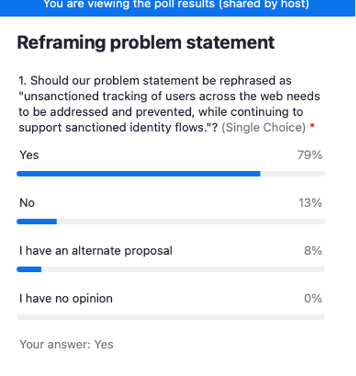

FedID CG Telecon, 20 August 2021
===============================
-   Moderator: Heather Flanagan

-   Scribe: Andrew Hughes

Call-in details: see
[<u>https://lists.w3.org/Archives/Member/internal-fed-id/2021Aug/0000.html</u>](https://lists.w3.org/Archives/Member/internal-fed-id/2021Aug/0000.html)

Charter:
[<u>https://github.com/w3c/fedidcg</u>](https://github.com/w3c/fedidcg)

## Pre-Reading
* [Federation and Browsers Workshop Notes, May 26](https://github.com/WICG/WebID/blob/main/meetings/2021/2021-05-26-notes.md) (see "What problems are we (trying to) solving")
* [Unsanctioned Web Tracking](https://www.w3.org/2001/tag/doc/unsanctioned-tracking/)
* [Tracking Preference Expression](https://www.w3.org/TR/tracking-dnt/)

## Agenda

* Administrivia
  * Scribe volunteer(s)?
  * Reminders: 
     * [Community Group Membership](https://www.w3.org/community/fed-id/)
     * [W3C Code of Ethics and Professional Conduct](https://www.w3.org/Consortium/cepc/)
  * [Chair Selection](https://github.com/w3c/fedidcg/blob/gh-pages/Federated%20Identity%20Community%20Group%20Charter.md#chair-selection)
      * Co-chair nomination - [Kris Chapman](https://lists.w3.org/Archives/Public/public-fed-id/2021Aug/0005.html)
  * [GitHub organization](https://github.com/fedidcg)
  * Call scheduling

* Validating the problem statement, "Non-transparent, uncontrollable tracking of users across the web needs to be addressed and prevented."

* Call for [Proposals](https://github.com/fedidcg/proposals)

* Any Other Business

Meeting notes
=============

-   Heather runs through the administrivia

-   HF: Kris Chapman (Salesforce) has volunteered to be 2nd co-chair

    -   No objections - congratulations Kris

-   HF: Tim has set up github organization

    -   Still adjusting links pointing to the correct repo

    -   Modelled on the Privacy CG structure

-   HF: 2 call times have been scheduled APAC and US/EU - invitations
    have been circulated and on the W3 meeting calendar

-   HF: please add yourself to the attendees list at the bottom of this
    document

Validating the problem statement 
--------------------------------

"Non-transparent, uncontrollable tracking of users across the web needs
to be addressed and prevented."

-   HF: pre-reading includes pointer to W3C workshop - the statement
   below came out of it - a good start - we should refine it

-   HF: ie how to adjust the federated ID flow through browsers to make
    it non-tracking

-   GF: interesting that there's no Identity or Federation in the
    problem statement

    -   Point is that we want Federated ID (or identity in general) to
        work in the browser ecosystem and also to prevent unconsented
        tracking/surveillance

    -   We should prevent the ad tracking problem but not at the expense
        of making the identity/security user experience (identity
        problem) worse

    -   E.g. to provide good UX to users - identify them as much as
        possible but avoid over-identification. If we take away the
        tracking capabilities we make UX worse. We want to improve
        tracking for better security and UX - but not for ad trackers
        in unconsented/unconstrained scenario

    -   Preserve identity without enabling the non-transparent
        uncontrollable tracking

-   Tzviya (TS) - this is largely a Western group - need to consider
    identity in the rest of the world. Concepts like censorship - how
    does identity intersect with censorship. Potential here is to
    address beyond Ads - does it touch on misinformation. Consider
    that Ads might not be the only area of focus

-   Lee G: We track people - that's what identity is about. Can we solve
    the non-transparent and uncontrollable part? Even if we cannot
    stop the tracking part? “We track people - that’s what they want
    us to do” - a common statement

-   Brian May: scope should go beyond advertising - question is: is the
    user aware of the data uses? The ad tracking problem is that
    people are not aware and stuff surprises them - content that is
    too accurate - and no way to connect that to what they did. There
    are cases where user trusts the entity and is OK with certain
    actions - trust should be treated appropriately

-   HF: Parsing the problem statement… unsanctioned web tracking - was a
    W3C TAG finding (unsanctioned versus sanctioned). Can we add
    clarity by using that language instead of ‘non-transparent,
    uncontrollable)

-   Achim: +1 George - somehow we forgot that it’s about ‘identity’

    -   Tracking is convoluted and loaded term - should refine to
        clarify meaning

    -   “Tracking” tends to be synonymous with “ad tracking” - but we
        need to be clear

    -   FedID in the browser context - 2 entities - browser and IDP -
        each has different views on the user and what is deemed
        sanctioned/unsanctioned - each has different knowledge levels
        about the user

-   Hirsch Singhal: Identity is about tracking the user - but if you
    tell them they are upset because of bad connotations. Can we make
    a publicly known distinction between ‘identifying you’ versus
    ‘selling you stuff’

-   Kristen C: +1 unsanctioned. We can actually increase transparency
    and control - but that does not necessarily meet the consumer’s
    needs - information overload. Onus can’t be on the site owner side
    to guarantee user understanding - too much. Careful - avoid
    pushing the complexity into the privacy statement - it’s too hard
    for people to understand/consume. Also reduce popups !

-   HF: unnatural addiction to Polls :-)

-   GF: worried about ‘sanctioned’ because it implies that there’s a
    commonly-agreed definition - but that’s not going to be true

-   Lee: Feels like “sanctioned identity flows” is rough - needs a
    different term - not ‘tracking’ but ‘sanctioned is not perfect
    yet - needs improvement

-   Melanie R: Wonders if the sanctioned/unsanctioned should come from
    the user not from some other party?

    -   There’s identity for identity’s sake - should we be concerned
        about data collected during an identity flow (sanctioned) that
        is used for other purposes (the unsanctioned uses)

-   Kristen: Maybe “user-sanctioned” - need to put the user in control

    -   \[several +1s in the chat\]

-   Tony: Does this end at the federation? Or does this go into the
    platform - ie tracking inside the platform. Do the rules on access
    to an RP flow on into the platform side.

    -   HF: Might be out of scope - focus on the frontend maybe?

-   Judith: Reading the TAG doc on sanctioned/unsanctioned - good
    definition of ‘sanctioned’ but the distinction between states
    might not be as distinct

    -   Note that cookies are categorized as ‘sanctioned’ - and then
        it’s up to browser UX to make that sanctioned tech visible and
        manageable for the user. TAG doc seems to say - “these are
        sanctioned tech for tracking”. Are people comfortable with the
        distinction made in the TAG doc?

-   Hirsch: +1 Tony - how much does solidification of the authentication
    protocol fix problems with the RP. Experience is - fixed
    authentication protocols do not limit RP behaviour (good or bad).

-   Achim: SLippery slope trying to put a dividing line of ‘what happens
    before vs what happens after’ into the scope. Is it in scope of
    W3C to vouch for how RP is doing data processing?

-   John B: Re Tony. After what we normally think of as ‘federated
    authentication’ - it’s about 3rd party authentication events, not
    1st party. A typical pattern for big orgs is to have several top
    level domains that users access - and then an internal federation
    for access control. WE cannot ignore after the user/browser gets
    through 3rd party authentication/external federation. Also
    ‘decorated links’ might be affected by some of the privacy
    proposals.

    -   Being too prescriptive about what can/cannot be sent in the
        redirect will just shift where the ‘bad’ stuff happens (ED:
        squeeze the toothpaste tube)

-   GF: What the RP can do with the data & what’s shared with the RP -
    this is very difficult to enforce. Sites use 3rd party
    federation - when you sign up with a 3rd party you go back to the
    original page to collect additional data that cannot come from the
    3rd party authentication (e.g. SSN and other direct data). RP can
    just ask for more data whenever they want to - again shifting the
    tracking/identification to different parts of the flow. Do we want
    to go down that path? Getting into data provenance mechanisms
    along with the attribute values - that would need a legal
    framework too.

-   Sam: +1 the good stuff :-)

    -   +1 Melanie - find ways users can express in their own words
        what’s going on - e.g. sanctioned/unsanctioned - need to find
        the words that users can paraphrase for themselves

    -   Different types of tracking by different orgs for different
        purposes. Conflation/entanglement is happening- as we resolve
        what actors and mechanisms could lead to disentanglement.

    -   Different users have different expectations - consumer users and
        enterprise users have different views on what tracking is
        acceptable

    -   “Principle of least surprise” very useful.

    -   This is a tough problem to address. Decouple the problem from
        the solution. Positions often come from a position of solution
        in mind - try to focus on clear problem statement(s)

    -   Sam’s personal notes:

        -   there are different types of tracking done by different type
            of organizations done by different purposes

        -   context: consumers vs enterprise- +1 on user language:
            what's the user's mental model?

        -   surprise, principle of least surprise: can you describe the
            necessity?

        -   principles: privacy/security trumps friction

        -   if this was an easy problem we wouldn't be here :)

        -   decoupling agreeing on the problem without the
            presupposition of a solution may be a good starting point

-   Brian C: REturn to the scope statement - there's lots of current
    work to prevent the unsanctioned tracking in many places. Many of
    those efforts are at odds with SSO/Federated tech/protocols. We
    are here to allow for legitimate/sanctioned SSO/cross domain
    communication - but that works within the constructs of the
    impending browser changes. We are not here to change how RPs
    behave. There are things in flight now to make RP abuse harder -
    and we have to work within that context.

-   TS: +1 Melanie, Sam - TAG document is old (5 years) - it’s relevant
    but it is dated. If we want to use it for more than just
    definitions we should request TAG update it.

-   VB: elaborate on Brian C: SHould separate digital wake vs federated
    ID - people voluntarily entering transaction in FedID - probably a
    EULA governing anyway. IN other WGs there will be measures
    developed to prevent passive tracking of digital wake and unknown
    surveillance. Need to focus on the context of “the user knows”
    they are in a federated authentication scenario adn make this part
    better.

<!-- -->

-   HF: next steps

    -   Lots of good feedback on the problem statement - chairs to
        refine

    -   Use TAG document for its definitions - HF will ask TAG if they
        will update the document?

-   Andrew: Suggested to try to phrase the problem statement (maybe
    solution statement ) using positive terms and language

-   GF: what do we want to achieve with the problem statement

    -   HF: we want a super-crisp problem statement to encourage
        proposals to fix all or part of the problem. And for proposals
        to be able to define what’s out of scope for them.

    -   GF: We have discussed many different problem spaces today - is
        it feasible to have one statement - or should we have a
        categorized/hierarchical list of problem aspects?

    -   Sam: We (the WebID team at Google) previously 3 different
        problems described:

        -   The classification problem: The browser cannot differentiate
            between good/bad tracking - so they just add friction
            everywhere. From a threat model perspective - trackers can
            disguise themselves as sanctioned tracking.

        -   The RP tracking problem: Federation unintentionally enables
            RP tracking - use of global identifiers that allow RP to
            do cross domain correlation.

        -   The IDP tracking problem: IDP get to learn lots about user
            activities/whereabouts.

-   HF: good discussion - chairs will review the notes & review some of
    this on the APAC call and wrap up on next EU/US call.

-   HF meeting adjourned.

Attendees (sign yourself in):
=============================

-   Achim Schlosser (EnID)

-   Melanie Richards (Microsoft)

-   Daniela Pöhn (Universität der Bundeswehr München)

-   Brian May (dstillery)

-   Lee Graber (Tableau/Salesforce)

-   Kris Chapman (Salesforce)

-   Tim Cappalli (Microsoft Identity)

-   Hirsch Singhal (Microsoft Identity)

-   Janak Amarasena (WSO2)

-   George Fletcher (Verizon Media)

-   Filip Skokan (Auth0)

-   Reman Child (Okta)

-   Sophie Pham (Adobe)

-   Christos Kanellopoulos

-   Anthony Nadalin

-   Tzviya Siegman (wiley)

-   Sam Goto (Google)

-   Ryan Avecilla (Neustar)

-   Allan Spiegel

-   Andrew Hughes

-   Bjorn Helm

-   Judith Bush (OCLC)

-   Bill Densmore (ITEGA.ORG)

-   Vittorio Bertocci (Auth0 \|Okta)

-   Wendy Seltzer (W3C)

-   Harneet Sidhana

-   Heather Flanagan
