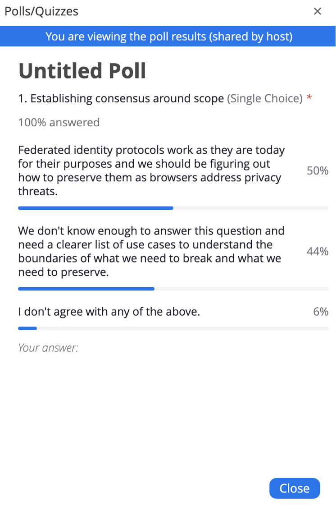

-   Moderator: Heather Flanagan

-   Scribe: George Fletcher, Kaan Icer

Call-in details: see
[<u>https://lists.w3.org/Archives/Member/internal-fed-id/2021Aug/0000.html</u>](https://lists.w3.org/Archives/Member/internal-fed-id/2021Aug/0000.html)

Charter:
[<u>https://github.com/w3c/fedidcg</u>](https://github.com/w3c/fedidcg)

Agenda
======

Administrivia
-------------

-   Scribe volunteer(s)?

    -   George Fletcher

-   Reminders:

    -   [<u>Community Group
  Membership</u>](https://www.w3.org/community/fed-id/)

    -   [<u>W3C Code of Ethics and Professional
  Conduct</u>](https://www.w3.org/Consortium/cepc/)

Ad Hoc Call update - [<u>https://github.com/fedidcg/meetings/blob/main/2021/2021-10-08-notes.md</u>](https://github.com/fedidcg/meetings/blob/main/2021/2021-10-08-notes.md) 
----------------------------------------------------------------------------------------------------------------------------------------------------------------------------

-   Poll

-   Heather: On APAC call. Not moving fast enough between the calls
   being every other week. Tried having ad-hoc calls on Friday. Good
   discussion in that meeting. One item discussed is the scope of the
   Federated ID CG. Created a poll to get a sense of the group in
   regards to scope for the CG. Options pulled from the notes on
   Friday.

-   Poll Results

-   

-   James R: Trying to understand the problem we try to solve and its
   urgency. We need to establish a policy initially to guide which
   route(s) we pursue.

-   Heather: Need some time to think about what this means

-   Kristen: Very interesting results. Need more clarification.

-   George: I answered the 1st option. We have to understand the impact
   of the Web.

-   Christos: Need to understand history and recognize what is has taken
   to get this point from a deployment and adoption perspective. We
   have a global running system and need to take an incremental
   approach to get to the end state. We can’t say we’ll break
   everything because it can be abused for unsanctioned tracking. Not
   tenable to

It’s very difficult to proceed with let’s break everything because of
the security (as a rep from the academic world)

-   Brian May: There are few of us in this group compared to those that
   will be affected. Having a balance of people on both sides is very
   healthy. Identify use cases that are highest priority and then
   evaluate pros and cons. Propose something the preserves the status
   quo meaningfully.

<!-- -->

-   Igraber - The impact of breaking everything down, the understanding
   of that, we should forget that it’s for covering something.

-   Vittorio: The main point is that the mission of preserving privacy
   for the user is a good one. Concerned that we are focused on a set
   of users to protect them and that set of users don’t care. The
   urgent issue is making sure that use cases that are working
   continue to work while trying to improve the experience for those
   users who would like to protect their privacy. That’s why it’s
   important to focus, otherwise we’ll be our own enemy

<!-- -->

-   Kristen - I also voted 1st. Two reasons

    -   I don’t want to break things. What \# breakage is acceptable
  (60-70%???)

    -   Privacy concerns, there is an inflated risk associated with it.
  There is also a fundamental idea, of the idea of the internet,
  that I can be anonymous online can also be somewhat
  problematic.

-   Heather: Working with some of the people who created the Internet.
   They already knew each other already. Access to the network was
   because you were known. The trust is a built-in concept to be in
   The Network.

<!-- -->

-   James: Huge problems on the web with people being anonymous. UK
   working on legislation that makes not being anonymous a key part
   of being online. Identity and identity solutions are fundamental
   now (similar to the plug in UK example that he showed). Changing
   the infrastructure is not really practical.

<!-- -->

-   Brian: Different models of federated identity. Having sketches of
   these models would be helpful. Some documentation on federation
   models would be helpful for the group.

-   CHristos: Privacy is not just technical. Looking at solving privacy
   with just technical means is not sufficient. There is alsa Legal
   aspect. GDPR, regulation that intended to help protect the user’s
   privacy. Instead we have a plethora of cookie banners. Need to
   address privacy in a holistic manner and not just for specific
   flows. We need to be very careful when we talk about breaking
   something. It requires a huge effort.

[<u>User Stories</u>](https://github.com/fedidcg/use-case-library) 
------------------------------------------------------------------

-   [<u>User Story: Interact seamlessly with multiple embedded resources
   as part of a web app · Issue \#8 · fedidcg/use-case-library
   (github.com)</u>](https://github.com/fedidcg/use-case-library/issues/8)

-   Heather: Privacy CG call yesterday. That group is still debating
   “what is tracking”? Can we qualify sanctioned vs unsanctioned
   tracking. Please submit PRs for the definitions on the wiki.

-   Tim: Slack (MS Teams). Top level app that embeds multiple apps
   within the top-level app. Some apps may be first party on the same
   origin, first party on a different origin, 3rd party on a
   different origin. The user wants seamless access to all these
   embedded apps. This is effectively sanctioned tracking. The same
   user is known across the embedded apps.

-   Lee: This use case is very relevant. Much of their business is
   embedding their services in multiple other top-level systems.
   Differentiate the idea that 3rd party cookies are tracking vs 3rd
   party cookies can be USED for tracking. Proposal around CHIPS
   (Google) is based . SSO across these apps is specifically about
   tracking the user across these domains. Is ok with solutions like
   CHIPS (and the one that Firefox uses - decorated links). Assuming
   that any use of 3rd party cookies means the user is be tracked
   without their consent.

-   Brian: Identifying a user across contexts is a very important
   concept. What are the uses for cross context sharing of identity.
   Focusing on these use cases and getting away from the tracking
   issue would be helpful.

-   Kristen - For me, tracking is not about the tech used/involved, it’s
   more about consent. In situations where the user is aware that the
   data is being collected I don’t think it’s a problem. AS long as
   the user has control.

<!-- -->

-   James: We should be focusing on harms and not on the tech used to
   perpetuate the harm. We should not characterize harms based on the
   technology. Identity isn’t a binary state. There are also middle
   states. If transferring money then both people need to know their
   identity with a high degree of certainty. Accessing a web site for
   free doesn’t require the same level of
   authentication/identification to provide a value exchange between
   the user, advertiser and website operator. We don’t tend to
   separate B2C and B2B use case. The B2C organization may require a
   B2B service to provide the experience the consumer is expecting.
   For example a website displaying rich data analysis might rely on
   a B2B business to supply this service and that B2B vendor might
   require some information about the identity of the user to provide
   that service. No harm is being done to the user in this scenario
   with the technologies involved.

-   Vittorio: this group shouldn't judge whether a use case a member
   presents has a right to exist or otherwise. If the use case exists
   and it is plausible, without suspicion of wrongdoing or user
   deception, we should assume that whatever "tracking" or
   tracking-like behavior is accepted by the participants in the
   scenario. As such, our work should be about identifying where the
   use case might break with the new privacy preserving measures, and
   understand what our options are to mitigate the issue..

-   Brian: One thing we should consider is that users may “sanction”
   something and then at a later time want to withdraw their consent.
   So the behavior changes from sanctioned to unsanctioned.

<!-- -->

-   Christos - Tracking is an active(?) world. To follow the user
   journey. It’s always user driven. How tracking happens here since
   it’s an active component.

-   George F - Agreed Vittorio - Addressing the use cases/ The issue is,
   the same primitive use for IDentity which is not for tracking, for
   unsanctioned tracking. Since the primitives are the same, at the
   root of the problem, how can we work together to resolve (adding
   some additional capabilities) unsanctioned tracking.

<!-- -->

-   James: Consent is asked of users via a popup before access to the
   site is given. This shouldn’t be considered as unsanctioned
   tracking.

-   Brian: Find it disturbing to prevent “tracking” via techincal means
   that prevents users from doing useful things. A more robust
   approach would be to focus on transparency and making things clear
   to users and make sure people have enough access to their data and
   then give them tools to extract themselves from undesired
   behaviors. Like: we can’t remove all the sharp stuff from the
   world, which are useful in the kitchen.

-   Tim: We deviate from the top-level use case and focus on the
   philosophical aspects. Enjoying the conversation but still
   off-topic.

-   Heather: still need to agree on terminology. Need to get there
   before making forward progress.

-   Tim: Struggles with a normal sign-in flow being characterized as
   “tracking”. The capabilities are being used as designed.

-   Christos: Are browsers the correct place to solve the problem? Or is
   there a better way? This becomes much more difficult to discuss
   because browsers may not be the correct place to address a
   possible privacy harm.

-   Heather: inspired by what the browsers are doing and ensuring

Ad-hoc call next week

-   Heather: will be working on processing the notes and see where the
   group goes next

From the Chat:

Heather Flanagan (she/hers)ToEveryone

I don’t think so; I think it’s more like a “right to be forgotten”. To
say “whatever you have about me, you’re going to erase it when I say you
have to”

Brian MayToEveryone

Yes, right to be forgotten or at least terms under which the
relationship can be amended.

Chris NeedhamToEveryone

To me, it's more like sign out + delete my data. Right to be forgotten
is different -
[https://en.wikipedia.org/wiki/Right\_to\_be\_forgotten](https://us02st1.zoom.us/web_client/5g6glw/html/externalLinkPage.html?ref=https://en.wikipedia.org/wiki/Right_to_be_forgotten)

Tim CappalliToEveryone

ok. I heard it more as removing my consent to be tracked for the
purposes of identifying me to the service for operation and access
control

(aka sign in)

Brian MayToEveryone

Good point Tim and good idea to identify when we’re deviating from the
topic, note it and turn back to the primary focus.

Tim CappalliToEveryone

PLEASE SUBMIT USE CASES!!!

even if it's just a title

Any Other Business
------------------

General Library of Useful Reading
=================================

-   [<u>Unsanctioned Web
   Tracking</u>](https://www.w3.org/2001/tag/doc/unsanctioned-tracking/)

-   [<u>Tracking Preference
   Expression</u>](https://www.w3.org/TR/tracking-dnt/)

-   [<u>W3C TAG Ethical Web
   Principles</u>](https://www.w3.org/2001/tag/doc/ethical-web-principles/)

-   [<u>Self-Review Questionnaire: Security and
   Privacy</u>](https://www.w3.org/TR/security-privacy-questionnaire/)

-   [<u>Web Platform Design
   Principles</u>](https://w3ctag.github.io/design-principles/)

Attendees (sign yourself in):
=============================

-   Heather Flanagan (Spherical Cow Consulting, chair)

-   Kris Chapman (Salesforce, co-chair)

-   Tim Cappalli (Microsoft Identity, co-chair)

-   George Fletcher (Yahoo Inc.)

-   Brian May (dstillery)

-   Brian Campbell (Ping)

-   David Waite (Ping)

-   Ken Buchanan (Google)

-   Chris Needham (BBC)

-   Allan Spiegel (Adobe)

-   James Rosewell (51Degrees)

-   Lee Graber (Tableau/Salesforce)

-   Kaan Icer (Google)

-   Ryan Avecilla (Neustar)

-   Vittorio Bertocci (Auth0\|Okta)

-   Emily Lauber (Microsoft)

-   Nikos Fotiou (AUEB)

-   Peter Gietz (DAASI International)

-   Christian Biesinger (Google)

-   Judith Bush (OCLC)

-   Christos Kanellopoulos (GEANT)

-   Michael Knowles (Google)

-   Beri Lee (Google)
