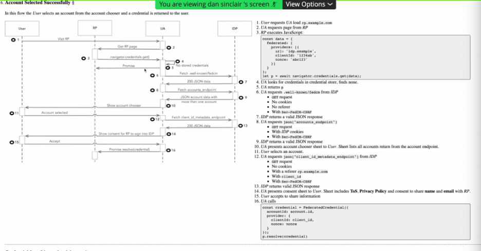
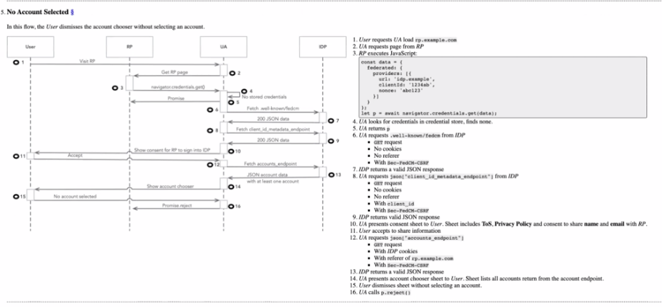
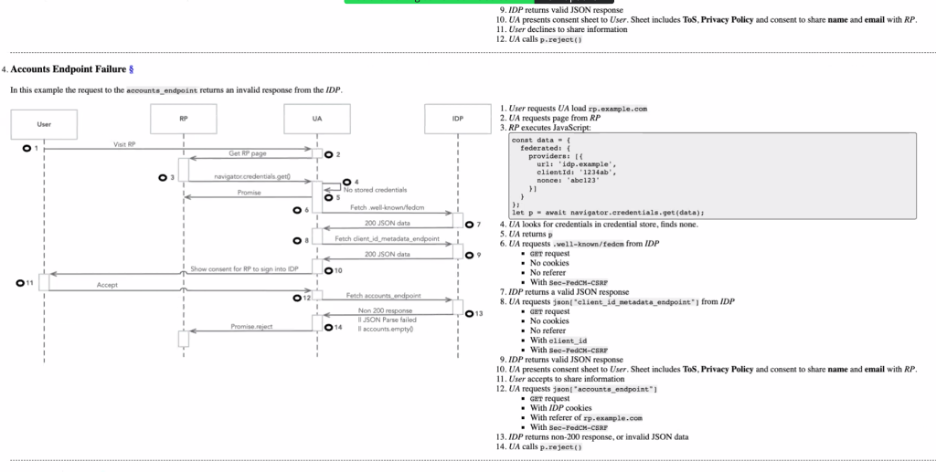
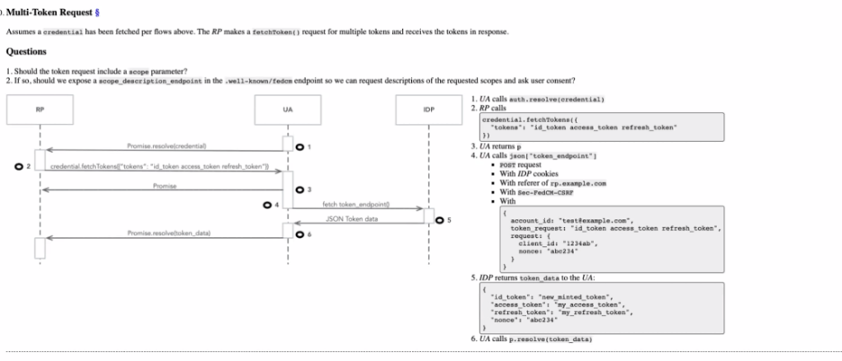
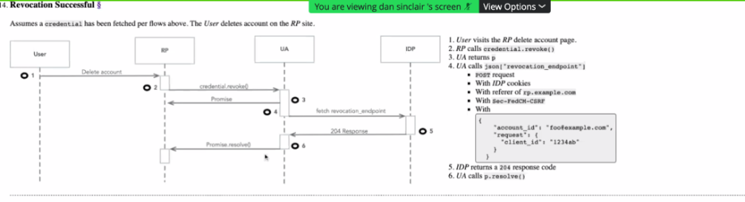
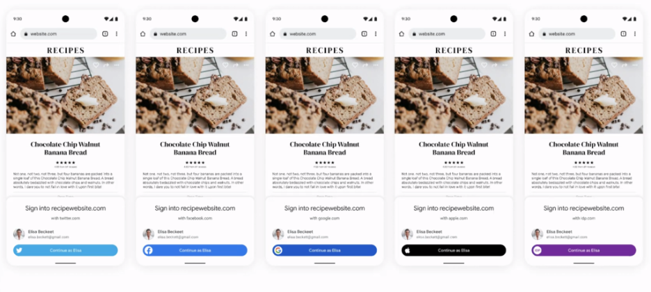

# 19 November 2021 (Europe/Americas)

-   Moderator: Heather Flanagan

-   Scribe:

Call-in details: see
[<u>https://lists.w3.org/Archives/Member/internal-fed-id/2021Aug/0000.html</u>](https://lists.w3.org/Archives/Member/internal-fed-id/2021Aug/0000.html)

Charter:
[<u>https://github.com/w3c/fedidcg</u>](https://github.com/w3c/fedidcg)

Notes
======

Administrivia
-------------

-   Scribe volunteer(s)? Kaan

<!-- -->

-   Reminders:

    -   [<u>Community Group Membership</u>](https://www.w3.org/community/fed-id/)

    -   [<u>W3C Code of Ethics and Professional Conduct</u>](https://www.w3.org/Consortium/cepc/)

[<u>Federated Credential Management API</u>](https://github.com/WICG/FedCM) (Dan, Sam) 
--------------------------------------------------------------------------------------

Any Other Business
------------------

Notes
=====

Dan (Google) introduced himself

Presentation -

We are only focusing on 3PCD

The main use case will be the one-tap widget. Goal is to unblock this
use case

The presentation show the ongoing model:
[<u>https://github.com/WICG/FedCM</u>](https://github.com/WICG/FedCM)

The use cases

-   Sign up

-   Sign in

-   Sign out

-   Auto sign in

-   Revocation

Explaining the details of how API functions.

High level design:
[<u>https://wicg.github.io/FedCM/\#high-level-design</u>](https://wicg.github.io/FedCM/#high-level-design)

Our expectation is to have minimum changes on RPs

On the IDP side, there are 5 endpoints.

1\. Manifest endpoint in a well-known location that points to

2\. Accounts List endpoint

3\. Client Metadata endpoint

4\. ID Token endpoint

5\. Revocation endpoint

Open Question: Do we need to expose these ID Token endpoint?

The Replying Part API

It covers RP’s response.

There is no response to the IDP, they don't know if it succeeded or
failed.

Inside the browser

There are account and session state machines

Browser always need to user consent to sign up

Yi (from the chat) - Note: front channel logout is mainly for enterprise
use cases so IDPs can log users out

Tim: I’m little concerned about everyone uses a different language (sign
in / sign up)

Sam: What is implemented now, plan is to IDP tells us, and the message
can be customizable.

Sam - Bowser doesn’t care about sign up or sign in. What we present here
is to the internal state machine.

Achim: some of this has been discussed in issues in the FedCM github
repository
([<u>https://github.com/WICG/FedCM/issues/127</u>](https://github.com/WICG/FedCM/issues/127))

Video demo (presented at TPAC):
[<u>https://drive.google.com/file/d/1m3LxIvK8Dss0m-7ASP9AcgPC0K4FcT8i/view?usp=sharing</u>](https://drive.google.com/file/d/1m3LxIvK8Dss0m-7ASP9AcgPC0K4FcT8i/view?usp=sharing)

John - How does the user actually logged into the IDP in the first
instance? What happens when there are multiple accounts at the IdP?

Dan: 1st answer- They could already have been signed into the IDP. If
they are not signed to the IDP you don’t get Auto sign-in. SO one-tap
will not appear. It will be a top level redirect to the IDP to signin.

John: What if there are multiple accounts?

Dan: Browser will come back with a box showing the accounts user have,
then the user consent page will appear.

Dan: Authorization is still in TBD.

Sam Goto to Everyone (8:28 AM) - account chooser UI here; it also
includes the
account\_id[<u>https://w3ccommunity.slack.com/files/U022YN074Q4/F02L3UXF4LB/fedcm\_\_\_tpac\_2021.pdf</u>](https://w3ccommunity.slack.com/files/U022YN074Q4/F02L3UXF4LB/fedcm___tpac_2021.pdf)

Kristen - We are the IDP, and you have the Salesforce accounts. We
manage the main Salesforce you logged in. Revocation - Revocation from
the service, not from the main account? Revocation from any particular
RP?

Dan: Revoke for all services can be done from the IDP side. We are
assuming the intent signal what to clean up, it will be clean up for
all. Please file a bug in the FedCM repo.

Kristen - I would prefer to have some signals and I can use it how I
need. I will submit a bug to the repo.

Achim - It needs to be clear to the user should that also mean that the
data with the RP also will be purged. It is tricky for most of the use
cases. Language is very important for the revocation.

Dan: IDP could tell the RP. We think if they want to do that, IDP has to
tell the RP for authorized logout. This is still an open question?

If there are any relevant issue (i.e. GDPR) needs to be considered here/

Achim - Logout must be optional. It’s also a technical benefit to RP
(for the Legal consequences). Front channel logout should be optional
from my point of view.

Dan - The flow diagrams in the specs are generally correct, but may need
some changes.

-   Account Selected Successfully

-   If user selects No

-   Endpoint failure:

-   Multi token request

-   Revocation

Achim - The accountID - How is that handled? Just handled within the API
communicate with the API? Maybe sometimes visible without the IDP
knowing?

Dan - Per the conversation with Sam. There are some questions like: What
is account ID, What is the RP and IDP need to know? Do we need to store
the reverse mapping? Is there an ID that we can ask RP? I have a giant
comment on my own PR, please let me know where I was wrong.

Dan - Are ID tokens long-lived or expired?

Achim - Expire

Dan - How long? Depends on IDP?

Tim - They are getting longer in many cases.

Brian - id tokens are generally supposed to facilitate the SSO and not
be used or retained after

Kristen - RPs multiple account multiple email address. User wanting to
have specific email address for a specific RP. Are you thinking anything
about nesting emailID?

Single account with multiple email addresses?

Dan - I have not thought about that?

Sam - We need to think about it. How do we implement in the browser. It
needs to be covered here.

Sam is presenting -

This can be an answer to John’s question about multiple account.

Branding and customization - Ability of the IDP to control the
color/icon of the buttons.

It is a small step but it gives you the intent.

Dan - The orientation of the spec. DO we need to change the current?

Tim - For the

Achim - We have to build new endpoints for the not OpenID orientation.

Heather - SAML doesn’t use 3rd party cookies. The link decoration time
we might need to re-consider SAML

Tim - There are experiences for SAML that could benefit this UI. There
is certainly a user benefit here. That is definitely some new work to be
done. That deserves a good offline conversation.

DAN - Please feel free to add bugs to the spec in the repo.

Lee (from chat) - If the spec is meant to cover enterprise scenarios …
then SAML is still there

Sam (from chat) Dan, the other bit that we have implemented/experimented
ith that i think may be worth showing is the
branding/extendibility/customization affordances, e.g. button color and
button icon. Unclear if of the interest of this group, but that occurred
to me as something that we have implemented that you didn't go through.

Yi (from chat) Branding is at \~20:54. Dan feel free to present it.
[<u>https://watch.videodelivery.net/29bab61e04e8cabf1517e5885c9fe4cf</u>](https://watch.videodelivery.net/29bab61e04e8cabf1517e5885c9fe4cf)

Sam (from chat) One interesting discussion that this group feel like the
right / best one to have, is how/whether we make this current spec
applicable to preserve SAML. It currently is very OIDC oriented, but it
would be good to solve SAML without redoing a lot of work too.

Christian (from chat) FYI the current API does not let the RP get a
\*list\* of accounts; only the one account the user selected to log in
with

General Library of Useful Reading
=================================

-   [<u>Unsanctioned Web Tracking</u>](https://www.w3.org/2001/tag/doc/unsanctioned-tracking/)

-   [<u>Tracking Preference Expression</u>](https://www.w3.org/TR/tracking-dnt/)

-   [<u>W3C TAG Ethical Web Principles</u>](https://www.w3.org/2001/tag/doc/ethical-web-principles/)

-   [<u>Self-Review Questionnaire: Security and Privacy</u>](https://www.w3.org/TR/security-privacy-questionnaire/)

-   [<u>Web Platform Design Principles</u>](https://w3ctag.github.io/design-principles/)

-   [<u>Authentication vs Federation vs SSO</u>](https://medium.com/@robert.broeckelmann/authentication-vs-federation-vs-sso-9586b06b1380)

-   [<u>Keeping Your APIs Secure for Multiple User Types</u>](https://medium.com/@robert.broeckelmann/keeping-your-apis-secure-for-multiple-user-types-d5c627793c4c)

Attendees (sign yourself in):
=============================

-   dan sinclair (Google; Chrome)

-   Brian May (dstillery)

-   Allan Spiegel (Adobe)

-   Kris Chapman (Co-chair, Salesforce)

-   Kaan Icer (Google)

-   Yi Gu (Google)

-   Christian Biesinger (Google)

-   Achim Schlosser (European netID Foundation)

-   Heather Flanagan (Chair, Spherical Cow Consulting)

-   Brian Campbell (Ping)

-   Dmitry Shalashov

-   Emily Roberts (PwC)

-   Sam Goto (Google)

-   Michael Knowles (Google)

-   Tim Cappalli (Microsoft)

-   Peter KH

-   John Bradley (Yubico)

-   Beri Lee (Google)

-   Björn Hjelm (Verizon)

-   Lee Graber (Salesforce)

-   Emily Lauber (Microsoft)

-   Bill Densmore
