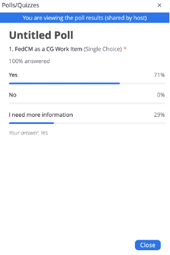
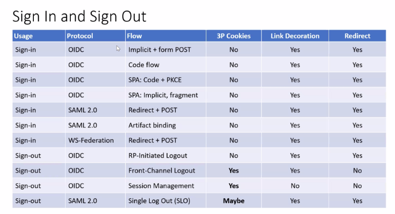

# 3 December 2021 (Atlantic)

-   Moderator: Heather Flanagan

-   Scribes: Tim, Kaan

Call-in details: see
[<u>https://lists.w3.org/Archives/Member/internal-fed-id/2021Aug/0000.html</u>](https://lists.w3.org/Archives/Member/internal-fed-id/2021Aug/0000.html)

Charter:
[<u>https://github.com/w3c/fedidcg</u>](https://github.com/w3c/fedidcg)

Agenda
======

Administrivia
-------------

-   Scribe volunteer(s): Kaan Icer

<!-- -->

-   Reminders:

    -   [<u>Community Group Membership</u>](https://www.w3.org/community/fed-id/)

    -   [<u>W3C Code of Ethics and Professional Conduct</u>](https://www.w3.org/Consortium/cepc/)

Use Case Review
---------------

-   [<u>User Story: Sign into RP with embedded resources \#13</u>](https://github.com/fedidcg/use-case-library/issues/13)

-   [<u>User Story: Session Extention \#14</u>](https://github.com/fedidcg/use-case-library/issues/14)

Work Item
---------

-   [<u>Fed CM Proposal</u>](https://github.com/fedidcg/proposals/issues/1)

Any Other Business
------------------

Notes
=====

\[Heather\] Take a look at the Browser vs Identity session from OSW
earlier this week

Slides (video coming soon):
[<u>OSW2021-Identity\_vs\_Browser.pdf</u>](https://drive.google.com/file/d/1Kw0eFPogu-FbBU2DkUoGQLH0xpi-6oJd/view?usp=sharing)

\[Heather\] Bringing in a work item doesn’t necessarily mean you fully
support it, especially since it's not done, but you’re willing to
provide feedback

First case - Issue \#13 -
[<u>https://github.com/fedidcg/use-case-library/issues/13</u>](https://github.com/fedidcg/use-case-library/issues/13)

\[Beri\] We have 2 use cases

1 - User goes and signed in to IDP

2 - User is not signed in with IDP

Sam - What is the difference between the LMS and the IDP

Beri - IDP and the LMS are not the same.

Sam - Functionality?

Tim - It’s the Learning Management System, not Login MS.

Beri - The input/thoughts from the group for the Case 1 are welcomed

{Group waited for comment/question}

Heather - LMS and MSFT Teams cases are similar.

Tim - Top level LMS sites will likely to redirect

Beri - Looking at the Case \#2, Step 4.

Tim - It redirects from login.microsoft.com to login.microsoftonline.com
and it redirects back to login.microsoft.com, which then redirects to
the initiator.

V: Is the scenario you presented here, in place or is it the plan
(hypothesis) for now?

B: It’s a hypothesis for now. If the HOW is here resonitates you great,
if not we are open to hear the feedback

Peter: Are there cases where the toplevel redirect (ex via
window.top.location.href) is initiated by an iframe?

Vittorio: As functionally, I’ve seen it.

Beri - Session Extension case:
[<u>https://github.com/fedidcg/use-case-library/issues/14</u>](https://github.com/fedidcg/use-case-library/issues/14)

Heather - Yes, this is a use case.

It needs a decision, RP and IDP get to decide. Whoever is short wins.
It’s a configurable thing. The timing depends on all directions.

Achim - Silent session (login state) with RP and IDP are different.
There are several different scenarios/details/use cases exist.

Vittorio - Sessions and tokens are different. Confusion on these can
bring security risks.

Sam W - What service/functionality RP wants IDP to provide?

Brian - Silent SSO is something we have been working on a lot.

Sam Goto - Without 3pC, how the thing works on browsers, is it graceful,
or break the flow?

Vittorio - It is not graceful. When it fails, it fails the function.

Example of use of an iframe in redirect based apps to extend the
session:

[<u>https://www.cloudidentity.com/blog/2016/07/25/controlling-a-web-apps-session-duration-2</u>](https://www.cloudidentity.com/blog/2016/07/25/controlling-a-web-apps-session-duration-2)

Heather - Checking if FedCM API can be a work item?

[<u>https://github.com/fedidcg/proposals/issues/1</u>](https://github.com/fedidcg/proposals/issues/1)

Brian - I’m not going to object to this, but it’s disjoint the 3PCD and
this proposal.

Sam G - I would love to get the specifics. This is one of the many
options we evaluated. There are some pros and cons for each. I don’t
disagree with the sentiment.

Brian May - The concern is this proposal takes the focus from the entire
framework

Heather: Poll results:

Heather - Here is the place to ask questions to provide more
information.

Vittorio - Per the table we (with Tim) worked (seen below), FedCM still
has a bigger scope than the 3pCD. Now, it feels a bit (?)

Sam - We think, the brakages of the 3pcd is smaller. We started in one
place (we have more information), but we are not married to the
solution.

Achim - We need redirect based login where the “car” breaks (referring
the car analogy)

Brian May - Video/deck that was proposed?

Heather - Tim will provide the link for the deck.

General Library of Useful Reading and Viewing
=================================

-   [<u>Unsanctioned Web Tracking</u>](https://www.w3.org/2001/tag/doc/unsanctioned-tracking/)

-   [<u>Tracking Preference Expression</u>](https://www.w3.org/TR/tracking-dnt/)

-   [<u>W3C TAG Ethical Web Principles</u>](https://www.w3.org/2001/tag/doc/ethical-web-principles/)

-   [<u>Self-Review Questionnaire: Security and Privacy</u>](https://www.w3.org/TR/security-privacy-questionnaire/)

-   [<u>Web Platform Design Principles</u>](https://w3ctag.github.io/design-principles/)

-   [<u>Authentication vs Federation vs SSO</u>](https://medium.com/@robert.broeckelmann/authentication-vs-federation-vs-sso-9586b06b1380)

-   [<u>Keeping Your APIs Secure for Multiple User Types</u>](https://medium.com/@robert.broeckelmann/keeping-your-apis-secure-for-multiple-user-types-d5c627793c4c)

- [OAuth Security Workshop 2021 session on Identity Flows and Browsers](./OSW2021-Identity_vs_Browser.pdf)

Attendees (sign yourself in):
=============================

-   Tim Cappalli (Microsoft Identity)

-   Daniela Pöhn (Universität der Bundeswehr München)

-   Brock Allen (Duende Software)

-   Brian Campbell (Ping)

-   Kaan Icer (Google)

-   Sam Goto (Google)

-   Michael Knowles (Google)

-   Beri Lee (Google)

-   Brian May (dstillery)

-   Vittorio Bertocci (Auth0 \| Okta )

-   Christian Biesinger (Google)

-   Yi Gu (Google)

-   Achim Schlosser (EnID)

-   Bonnie Stefanick

-   Peter KH

-   Heather Flanagan (Spherical Cow Consulting; chair)
