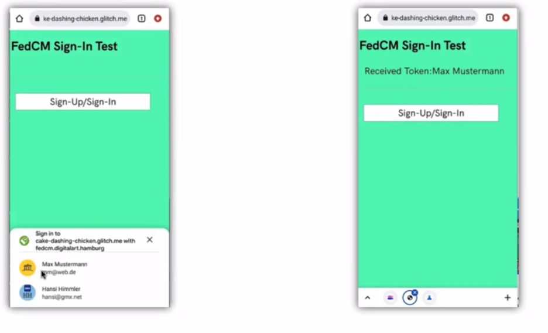

# FedID CG call, 28 February 2022 (Atlantic)

-   Moderator: Heather Flanagan

-   Scribe: Beri

Call-in details: see
[<u>https://www.w3.org/events/meetings/359d1ef8-6918-4a5f-bc7a-3ec23366752b/20220214T170000</u>](https://www.w3.org/events/meetings/359d1ef8-6918-4a5f-bc7a-3ec23366752b/20220214T170000)

Charter:
[<u>https://github.com/w3c/fedidcg</u>](https://github.com/w3c/fedidcg)

Agenda
======

Administrivia
-------------

-   Scribe volunteer(s) - Beri

-   Reminders:

    -   [<u>Community Group Membership</u>](https://www.w3.org/community/fed-id/) and the [<u>W3C Community Contributor License Agreement</u>](https://www.w3.org/community/about/agreements/cla/)

    -   [<u>W3C Code of Ethics and Professional Conduc</u>](https://www.w3.org/Consortium/cepc/)t

    -   [<u>Doodle poll for IIW planning</u>](https://doodle.com/poll/frbddbtcvtmm5piy?utm_source=poll&utm_medium=link)

-   Work Item - FedCM

    -   Experience with Testing (Achim)

    -   Next Steps

<!-- -->

-   [<u>Draft Community Group Report</u>](https://docs.google.com/document/d/1D-UbhD7_d_X8h1_aEFV-nrlkMf2pQDTuf_s70ycYj20/edit#)

-   AOB

Notes
=====

-   AI: all: Fill out the Doodle poll for IIW!

-   Tim: we want to maybe talk about things other than DID?

-   Tim: who’s going?

    -   Tim

    -   Heather

    -   ?

-   IIW:

    -   Internet identity workshop

    -   It’s an unconference

    -   They’re up to twice a year since 2005

    -   April one is at Computer History Museum in MTV

    -   As an unconference it’s a “bring your topic”, any topic is the
  right topic

    -   Over the years, there’s an interesting split of the type of
  people who go

    -   Folks with a really cool idea - e.g. DID and blockchains and
  things along those lines

    -   Some of the other conversations have sort of moved out of IIW
  because of DID / blockchain convos

    -   There’s usually between 100-200 people there (largest was 400)

    -   It’s big enough to get a good-sized audience

    -   Tim: it’s very casual, highly recommend if you’re in the area

-   Sam: does anyone know of an IIW-like thing that people have gone to
  that people go to for federated identity-like things?

    -   Tim: OSW (oauth sec workshop)

        -   It’s protocol security , not fedid specific

        -   It’s in Norway this week

-   Tim: at IIW you start each day with proposing agendas so it’s what
  we make it

-   Vittorio:

    -   Re: sam’s question: OSW: is ultra low level stuff

    -   It depends on what you want

    -   OSW is a bit like “the original IIW”

    -   Only very focused stuff shows up

    -   Consider attending Identiverse

        -   It’s a bit more on the business side

        -   It still retains significant portion of protocol components

        -   It would be interesting to see both sides - technical and
      what it enables

        -   It will let you see who might come after you if you break
      stuff

        -   Denver Colorado at the end of June

-   Sam: we typically attend browser stuff - e.g. tpac

    -   Request: please invite folks to each other’s parties

    -   TPAC: Sept 12

-   Heather: if folks want to share other conferences, use the slack
  channel

-   Brian May: maybe folks can have an issue to track conferences there

-   Heather: let’s move on to sole work item: FedCM

    -   Achim has done some interop tests

    -   Today: what did he do / how far did he get / etc

-   Achim:

    -   In product discovery / ideation phase for 2022/2023

    -   These things take a lot of time to get into prod, so it’s good
  to see something working

    -   Have a general interest in FedCM because other than the protocol
  stuff, the notion around interactions with IDP is something
  appealing

    -   Some tricky bits: few sources of truth around fedcm currently

        -   Working draft doc

        -   Published howto on github

        -   Chrome canary

        -   The above 3 things are not aligned

    -   Testing setup: what to do to prototype

        -   Current dev is mobile only

        -   RP prototype and IDP prototype have to live on secure
      origins

        -   Local is not an option

    -   Managed to get a prototype running

    -   If people are interested Achim has a private repo

    -   The prototype broke a few days later because of a change in
  chrome canary

    -   Pushes in the last few weeks, majority of challenges have been
  fixed

    -   Notes:

        -   Feature discovery is a bit tricky

        -   Discrepancy on endpoint names

        -   Fedcm runs in core browser engine - generic error messages
      didn’t tell you where things broke

        -   It was hard to debug

        -   Some things not documented

            -   Branding segment - what types of icons are supported not
          documented

        -   Adding chrome devtool support allowing for debugging should
      make things simpler

    -   Saw discussion around referral, availability of cookies, etc,
  have materialized in the API

    -   Other thing that seems to be in progress: syncing sign up and
  sign in states - seems to be in development, didn’t try it but
  saw it

    -   With syncing stuff: wonder about needing a set of claims

    -   API : 3 weeks ago was focused on ID tokens, but this is not the
  full spectrum of what is needed. Doesn’t include claims
  transfer and Authzn use cases (that don’t require signup/sign
  in)

    -   By chance saw a couple of pushes from Dan that introduces
  generic token support (e.g. access/refresh token)

    -   Started watching things more closely while prototyping

    -   Session extension can be done with access/refresh token support

    -   Thinking through: file use case \#7 in library, running idp
  federation(?) could this use fedcm? Which state is stored
  where

        -   Could result in more or less changes

        -   Package things in JS or server side

    -   Process wise:

        -   It’s tricky to get a feeling of what is being worked on

        -   There’s a lot going on

        -   It’s a bit hard to understand which github discussions are
      being incorporated where

        -   Talking to teams who work with RP/IDP - they’re a bit itchy
      about browser flows. How can one make sure that products
      don’t break when browser changes?

        -   Tight entanglement

-   Heather:

    -   You mentioned had to be on a point release of chrome canary

    -   Are you setup to do any sort of demo to show us what it looks
  like?

-   Achim:

    -   I have a video

-   Sam:

    -   Found this exercise so useful

    -   Trying to think of ways to make an invitation to replicate this

    -   Exercise Achim went through was extremely valuable to FedCM

    -   Submitted patches from an ergonomics and feature scoping
  perspective

    -   When Achim started this exercise, hopped on a VC call for 2
  hours

    -   It was probably the most effective way to get feedback and
  concretely act on it

    -   I know George has been suggesting a few things

    -   Thanks Achim for playing and making concrete suggestions to
  changes

-   Achim:

    -   Sign up and sign in demo with multiple account picker

    -   Didn’t understand how auto sign in is supposed to work

    -   

-   Sam: auto sign in is not quite working yet

-   George:

    -   As best i can tell, clicking sign up/in isn’t doing redirect

    -   How much change to oauth protocol was required?

-   Achim: not using real login infrastructure

    -   Prereq to work, use would have run through idp login

    -   Respective necessary authentication tokens need to be sitting on
  idp domain such that they can answer these calls

    -   wouldn’t change anything in oauth login

    -   Need respective info on idp

-   George: rp needs ot know if they should do full redirect flow or the
  fedcm flow

    -   Could we add an rp api

    -   Is the user logged into this rp

    -   If there’s nothing to show the user in the account chooser

    -   Federated login status - if user has been thru redirect flow in
  the past, trusts this RP&lt;&gt;IDP

    -   Maybe the RP should be able to ask the IDP, is there a logged in
  user at all

    -   This might help simplify the UI

    -   Brian: +1 to this suggestion

    -   

-   Sam (from chat) - that's a known issue: we need to figure out how to
  deal with the case where the user is not logged in to the IDP. one
  idea that occurred to us was to allow the IDP to send us an error
  code of some sort that tells the browsers "hey, navigate the user
  to this IDP page here so that the user can log into the IDP".

-   Sam:

    -   Login status API could be a way to address this

    -   Challenge with login status API : even if it’s just 1 bit, it’s
  an extra bit

    -   Imagine giving websites the ability to test whether user is
  logged in without user gesture / consent

-   George:

    -   Also limits the value of trying to use this flow

    -   Because as an RP it may not be worth it to try it and have it
  fail and then go back to redirect model

    -   If the user has done it in the past - if we track this in the
  browser context, if we know the user has done it, so it’s ok
  to share

    -   It’s not for a random site

    -   You’d want the flexibility to do both

    -   Can see lots of use cases to want to know ahead of time if one
  of my users is logged in

-   Achim:

    -   State is already there, it maps to the “registered state”...?

    -   Difference between registration v. sign up / sign in is already
  known tot he browser

    -   George: are you saying about exposing some of this registered
  state

-   George:

    -   Yea, managing this state over a long period of time

-   Sam:

    -   We do distinguish between sign up and sign in

    -   What is harder is the case in which this is the first time user
  visited

    -   If browser has never observed this sign up moment, wouldn’t want
  to expose your sign up status without user consent

-   Brian:

    -   Liked George’s idea when you have a pre-existing relationship

    -   Leaking a bit of info wouldn’t then be very problematic

    -   If there’s a logging of it in the browser - could measure if
  particular entities are abusing the API

-   Tim:

    -   Question: Sam: have you aligned this with conditional UI work in
  webauthn

    -   This isn’t just a chrome thing, this is an API level discussion

    -   Very concerned about there not being any plumbing in the spec

-   Sam:

    -   We haven’t been thinking about this enough

    -   Adam and I have monthly recurring meetings - moving parts both
  these projects

    -   Haven’t run into anything existentially

    -   From an API perspective we have aligned as much as possible

-   Tim: nothing broken..

    -   If you sync sign up states across devices

    -   Ultimately there needs to be a new sign in on another devices

    -   Selected another account

    -   Probably going to get exact similar popup that’s going to have a
  similar but slightly different for webauthn creds across
  different devices

    -   Why do i have to do this twice?

    -   Could we eliminate the webauthn flow entirely?

    -   Concerned about introducing major UI flow to users, could we
  collapse them into 1 flow?

-   Ben:

    -   Take a step back to what Brian mentioned:

        -   Allowing one bit of leakage and browser keeping an eye on it

    -   Try to avoid browser heuristics where possible

    -   Want to avoid undocumented heuristics

    -   It should be trying to protect the user without these types of
  things

-   Heather:

    -   It’s really hard to maintain these heuristics

-   Ben:

    -   Yep

-   Achim:

    -   Could we put some kind of link to webauthn sync work?

    -   Can you put a link to where that happens and where we can see
  more details on this?

    -   Tim:
  [https://github.com/w3c/webauthn/issues/1545](https://us02st1.zoom.us/web_client/zsc0psq/html/externalLinkPage.html?ref=https://github.com/w3c/webauthn/issues/1545)

-   Heather:

    -   Given the timeframe for when Google expects this out in OT, this
  is the last bit of time for gross level changes?

-   Sam:

    -   We expect changes to be infinitely living thing

    -   We expect product/spec will be forever changing

    -   There will be a lot of changes as we go along in the next 5-10
  years

    -   OT: is a moment in time when we can make backwards compatible
  changes

    -   It gets harder and harder to make backwards compatible changes

    -   Achim made a substantial amount of feedback and we were able to
  respond to a lot of his feedback

    -   Right now is a good time to jump in and help us shape things

-   Heather:

    -   Remind folks that we’re working on a CG report that we’d like to
  have out by the end of march

    -   [https://docs.google.com/document/d/1D-UbhD7\_d\_X8h1\_aEFV-nrlkMf2pQDTuf\_s70ycYj20/edit](https://us02st1.zoom.us/web_client/zsc0psq/html/externalLinkPage.html?ref=https://docs.google.com/document/d/1D-UbhD7_d_X8h1_aEFV-nrlkMf2pQDTuf_s70ycYj20/edit)

-   Kris:

    -   Thank Sam/Brian for feedback!

    -   There are some changes in the doc right now

    -   There are some things that need group input

    -   Put in the doc initially about fedcm/tracking concern

    -   It’s relevant for RPs and IDPs - user agent can still track

    -   Sam’s point is user agent can do it no matter what

    -   Kris: this comes up the most in various talks. User agent still
  can do it. It comes up frequently. Fear of walled gardens.

    -   For the group: should we remove it? Should we leave it in the
  report, essentially: “if this is your fear, what’s the
  solution because it’s where we are today”

    -   Sam had added FPS and CHIPs as other proposals

    -   Kris is wondering since there isn’t a whole lot of explanation
  about fps and chips

        -   Should we add proposals and include more info on them?

    -   All: please read through it and give feedback, generally and on
  these 2 items, summarized

        -   How should we address fear of user agent tracking

        -   Scope of doc - how much to include re: FPS and CHIPs

-   Vittorio:

    -   First we’re trying to saying “we’re preserving”

    -   Document: now we’re trying to say we’re trying to change how
  RPs/IDPs/Browsers operate

    -   It’s very different

    -   Document seems to be out there to teach IDPs how to exist
  without doing tracking

    -   If this is where the group is going, then i’d need to find a
  different way of engaging

    -   I’m trying to protect customers and address privacy concerns

    -   Achim’s test is a unit test, it doesn’t look like a higher level
  test of viability

-   Kris:

    -   I think that’s valid

    -   Personally am influenced by privacycg issues

    -   Which may have come thru while writing the doc

    -   Have raised this with privacycg - should get the 2 groups
  together to talk about these things

    -   We’re sort of diverging on what the expectations are

    -   We should talk about it as a unified group

-   

Attendees (sign yourself in):
=============================

-   Beri Lee (Google)

-   Brian May (dstillery)

-   David Hübner (DAASI International)

-   Ben VanderSloot (Mozilla)

-   Vittorio Bertocci (Auth0 \| Okta)

-   Kris Chapman (Salesforce / Co-chair)

-   Achim Schlosser (European netID Foundation)

-   Sam Weiler (W3C/MIT)

-   Sander Engelberts (OCLC)

-   dan sinclair (Google)

-   Christian Biesinger (Google)

-   Michael Knowles (Google)

-   Peter Kotwicz (Google)

-   Emily Lauber (Microsoft)

-   Matt Liu (The Washington Post)

-   George Fletcher (Capital One)

-   Kaan Icer (Google)

-   Jaime Perez (Yahoo)

-   Sam Goto (Google/Chrome)

-   Heather Flanagan (Spherical Cow Consulting / Chair)

-   Nicolás Peña Moreno (Google)

-   Yi Gu (Google)

-   Tim Cappalli (Microsoft Identity, co-chair)

-   Brian Campbell (Ping)

