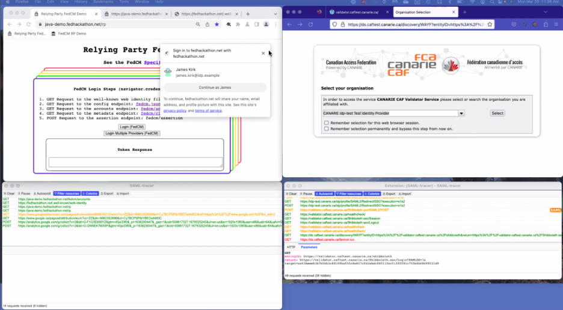

#FedID CG call notes (Atlantic), 20 March 2023

-   Moderator: Heather Flanagan

-   Scribe: Cameron Boozarjomehri

Call-in details: see
[<u>https://www.w3.org/events/meetings/</u>](https://www.w3.org/events/meetings/)

Charter:
[<u>https://github.com/w3c/fedidcg</u>](https://github.com/w3c/fedidcg)

Agenda
======

-   Administrivia

    -   Scribe volunteer(s)?

    -   Reminders:

        -   [<u>Community Group Membership</u>](https://www.w3.org/community/fed-id/)

        -   [<u>W3C Code of Ethics and Professional Conduct</u>](https://www.w3.org/Consortium/cepc/)

-   R&E Info-sharing and Hackathon outputs - clarifying the proposals

    -   [<u>idp-sp-storage API - issue 4</u>](https://github.com/fedidcg/proposals/issues/4)

    -   [<u>Offloading Trust - issue 5</u>](https://github.com/fedidcg/proposals/issues/5)

-   Planning for IIW (April 18-20)

-   AOB

    -   next call is an Atlantic call (27 March 2023).

Notes
=====

-   Re: Previous week’s discussion on:

    -   Given that model what would address the base need of preventing
  tracking across the web

-   Extensive notes from last week's

-   Focused previously on Issue 4

-   Martin had numerous pertinent Questions

-   How does this actually work in terms of turning on SAML tracing int
 he Browser and see what’s exactly happening with a FedCM flow

-   Issue 4 has now been updated in terms of which threats we are trying
 to solve for

-   Concern that these proposals may not be broadly applicable

-   What questions / comments / concerns to people have?

-   Cameron:

    -   Any specific feedback on design architecture?

-   Heather:

    -   Martin said it went into architecture without saying which
  threats we were trying to solve for

-   Sam:

    -   Paraphrasing Martin: Make sure we really understand what the
  problems are and are able to articulate them very clearly. Int
  erms of the baseline of the world that we are currently in /
  what the web supports today and the upcoming problems with or
  without FedCM as a baseline.

    -   Also: From architectural perspective try to make the web do as
  little as possible and get out of the way, instead of doing as
  much as possible.

    -   But first start from procedural feedback: State it as a question
  / what problems are we trying to solve.

-   Judith:

    -   There are discovery-oriented issues as well folded up in the
  full document

    -   WHile the browsers appreciate trust of the origin (which is a
  cookie-oriented space0 trust for authentication responses is
  different

    -   Because of that OIDC / OAuth2 / SAML - protocols are
  endpoint-oriented

    -   Azure points to idp by origin

    -   Lots of IDPs at the same origin

    -   Lots of providers in Edu (Cirrus?) sending the user to the
  origin via the browser means can’t disambiguate which IDP is
  intended by just specifying the origin

    -   So need more info in the request to disambiguate which IDP is
  indented

    -   Maybe add an identifier and at .well-known do the
  disambiguation?

    -   But for large provider that would be a very big .well-known

    -   But including more specific info might make it faster

    -   Also if trust to cookie / you trust the origin

    -   Multiple cloud providers have multiple endpoints

    -   Shouldn’t an IDP be pared with just one Office365?

    -   Not necessarily true

    -   Many SPs support multiple IDPs for a tenant

    -   The hospital is part of the University but also supports another
  IDP

    -   Also the hospital is also a tenant and wouldn’t know just from
  the origin which tenant is intended

    -   Lidlink? - journals may not have relationships with every IDP in
  the list

    -   So extending the request would help

    -   Also: Model for additional trust - there could be parties that
  could say that info provided by (SP? IDP?) has been vetted

-   George: (from chat) Just for reference, this OAuth spec defines how
 multiple issuers can be present on the same origin.
 [<u>https://www.rfc-editor.org/rfc/rfc8414.html</u>](https://www.rfc-editor.org/rfc/rfc8414.html)
 (Section 3.1)

-   Cameron:

    -   Feedback: Browser-driven redirect

    -   There will be a lot more flexibility up-front

    -   However extra step of browser-driven redirect

    -   Is there a concern over letting the browser taking this step,
  esp. Given the issues with .well-known being potentially huge

-   Judith

    -   Re: the size – if we’re modeling and focusing on current
  proposal, in the current model send one IDP as an origin. In
  new model you could send some metadata for IDP request (in
  addition to origin)

    -   Other proposal: Multiple IDPs (&gt;10) but currently just
  addressing this piece

    -   Point about .well-known, if there are many IDPs hosted at an
  origin, you can add metadata to directly identify the IDP,

    -   In discussion last week, discussed using existing FedCM as
  handshake to say “we’re done” and then do redirects

    -   But have not ensured FedCM to make sure that is ok for
  additional flows (eg., on the second trip, or if the user
  needs to choose among multiple IDPs)

-   wanpeng: (from chat)
 [<u>https://nat.sakimura.org/2016/01/15/idp-mix-up-attack-on-oauth-rfc6749/</u>](https://nat.sakimura.org/2016/01/15/idp-mix-up-attack-on-oauth-rfc6749/)

-   Phil:

    -   Agree with Sam’s comment on github that handling multiple (1000s
  of IDPs) is a problem

-   Sam:

    -   That’s some of what Martin was trying to point to – find
  problems with existing architecture that can be clearly
  articulated

    -   Eg., if 1000 IDPs were passed to FedCM as it is currently that
  is a problem.

    -   But that is tractable.

    -   Martin wanted us to be specific about the specific problems

    -   Disentangle the big problem and partition into smaller,
  independent problems that can be solved separately

    -   Also: Sessions (in Edu) are typically (800-63 NIST document)
  which specifies different levels of security and some of those
  are under an hour, and others are under 8 hours.

-   Gary:

    -   Typical Edu session are just a few hours (max 8)

-   Phil:

    -   Would FedCM make calls to IDPs to determine which accounts you
  have

    -   But in existing FedCM the user just chooses an account

    -   So it seems like a reversal fo that situation

-   Sam:

    -   Agree - that that doesn’t quite match

-   George:

    -   The session issue is a really complicated problem that we
  probably indeed to spin out

    -   If sessions are short, looking for accounts at the IDP requires
  remembering the last one or requires the Browser to remember
  multiple accounts at each IDP

    -   Won’t get SSO out of that knowledge – just the usernames at each
  IDP.

    -   ON the flip side lots of people are going to continuous
  authentication – as long as not idle for eg., 10 minutes

    -   So maybe split out session management specifically

-   Phil

    -   Difference between SSO session and Account

-   Sam

    -   Less scared about problem of short-lived session

    -   By the time the user has logged in to IDP once, have had
  opportunity to ask user for permission

    -   If we can capture that first point, there are many UI flows that
  can show the user that they have used a given account but
  probably logged out

    -   Eg., SEamless Access case of returning user

    -   Even if accounts are expired we can still remember UI traits

    -   Bigger problem is 1000s of IDPs and properly dealing with that
  rather than short-lived sessions

-   Judith

    -   Lots of people start with SP at the beginning of the day so the
  first hop through is most important

    -   If the there is a proxy or multiple hops then the IDP ends up
  effectively being an SP to other IDPs

    -   So there could be additional? Consent screens

-   Sam:

    -   Agree there are lots of cases where you start at the SP and go
  to the IDP

    -   Because seamless access has a graceful degradation strategy
  (show all IDPs that are known as an auto-complete UI)

    -   So if the session is short-lived or the user has never gone to a
  particular IDP in the past, should be able to use that flow to
  cover these cases.

    -   Won’t be the most efficient UI flow, but provides a baseline
  that will work in every circumstance we can think of UI
  optimizations to handle those caesars

-   Chris Phillips

    -   It’s a stateless experience because the user has not stated who
  they are. The service/discovery service hasn’t gotten to
  establish its home institution.

    -   It’s a walk of all the things the relying party knows about

    -   As a side by side, When FedCM has a discovery interface that
  allows it to show default/existing/prefered IDPs, versus
  typically ignoring session to simply show all possible IDPs

    -   The relying party would say “hey, you know these institutions”,
  it’s similar to the multi tenant one

-   Gary Windham

    -   The API model would be extended to the IDP RP relationship, and
  allow the RP via HTML to present that discovery interface

    -   Present something like the canary discovery service or seamless
  access and do that IDP relationship and have it persist with
  browser mediated UX

-   Sam Goto

    -   Good stuff, but this is the first time I have ever seen this
  demo

    -   Can you please walk us through this demo so we can understand
  the case

    -   Still a great example

-   Heather

    -   +1

-   Chris Phillips

-   Phil

    -   Calls FedCM API with provider

-   Chris:

    -   I thought this was the interface at eh hackathon

    -   So much detail in what is being said

    -   When comparing relying parties in R&E, we want to help orgs sign
  in and test ID provider and echo things back to you

-   Phil

    -   Sorry this was never shared so this is new

    -   Doing the same as Chrome canary in API

    -   Left is Canary and right is FX

-   Chris

    -   It has a union of things in the discovery service, so if I
  choose login then the step with the pop-up predicates that it
  is doing a walk of the relying parties “circle of trust”

    -   It works well up to maybe 10 (here it’s just 1) but after that
  it’s not clear how to scale

    -   Many orgs have different “where are you forms” but they all have
  the same patterns, like past IDPs or these are who we think
  you can log in with

    -   Browser will block some sharing for privacy

    -   The small test federation has many entities but there are no
  geographic boundaries so the real test comes from the origin.
  Is that origin in my set of trust?

    -   There’s the config endpoint and the FedCM accounts. The JS says
  that is James Kirk already signed in with IDP of 1

    -   Will go to shibboleth provider in this circle of trust, go to
  azure, sign in user, here’s my test tenant, return

    -   There is a Bounce, but in the SAML tracer side we can see the
  POST that includes the assertions and the summary.

    -   In the non-canary left-hand example, you have the option to
  “continue” where you associate with an existing session. Yes I
  was connected to an existing session, but in SAML this can
  look like many things

    -   In SAML this can include things like “contexts” which FedCM
  doesn’t have. Such as MFA, or Azure Context

    -   I hope to record this so I can elaborate

-   Heather

    -   Let me playback a few things I have heard

    -   1\) Most immediately to theDemo we are showing regardless of
  whether we have 3rd party cookies, FedCM is obstructing the
  SAML discovery flow

-   Chris

    -   That beginning problem we have with FedCM is lack of fidelity of
  how user authenticated

    -   There is no contextual information in FedCM on what happened

-   Gary

    -   Doesn’t provide for protocol level methods of what’s happening

    -   Encrypted Auth requests

-   Chris

    -   If I go to other IDPs and say look at this IDP without
  additional context, how do I know the relying party is
  deserving without sending something to the IDP

    -   I am giving something to the user and saying, I trust you to
  click something in HTML and CSS

    -   The notion that there is a wall between IDP and RP for Privacy,
  then user can just submit anything to every party

-   Heather

    -   We are concerned with: 1) the bootstrap problem, 2) SAML and
  Open ID Connect have different circles of trust, 3) 5 big
  problems that FedCM doesn’t address

    -   6 problems

        -   Scale - Lots of IDPs are hard to manage

        -   Interferes with SAML protocol outside 3rd party cookies

        -   Existence of anon/pseudo-anon users

            -   due to origin issue

        -   Origin vs endpoints (Proxies further confuse this)

        -   Minimal trust of all entities involved, why trust browser
      when browser is asking for something (no one might trust
      anyone in the flow)

        -   Session Information (Accounts vs. Sessions)

            -   Related but different problem: SP needs to request the
          user step up/MFA that requires user interaction at the
          IdP

-   Judith

    -   Sending IDs to SPs depends on IDP knowing SP by origin

    -   If that’s sufficient the IDP can make decisions about what to
  send back

    -   If no origin of what people deal with then becomes subset of
  origin problem

-   Chris Phillips

    -   Not clear how to address the currently 6 problems.

    -   Do we prioritize by difficult path?

-   Heather

    -   I just wanted to make sure they were documented correctly

    -   If we can split that based on what Martin was looking for then
  we can pull the pieces on what you did

-   Sam

    -   I have an intuition that we should prioritize the scale problem
  (right now we accommodate a few IDPs, not thousands)

    -   That was the first thing a user went through so if we don’t
  solve it we can’t get to other problems

    -   It’s also the place that is someone separated between issues 4
  and 5

-   Cameron

    -   Would definitely agree that the scale issue is huge

    -   Undermines the rest of the flow

    -   Origin vs. Endpoints / anon vs pseudo-non are also weird but
  come later after scale issue

    -   If we can’t address the huge number of IDPs - won’t even be able
  to get to subsequent issues

-   Heather

    -   Think about all of these / chat on Slack, etc.

    -   To discuss over the next week

    -   And we can revisit next week

    -   Also: IIW is coming up in 1 month or so

    -   People who can attend in person we will likely talk about proxy
  case

Attendees (sign yourself in)
============================

-   Heather Flanagan (Spherical Cow Consulting, chair)

-   Judith Bush (OCLC)

-   George Fletcher (Capital One)

-   Gary Windham (Cirrus Identity)

-   Cameron Boozarjomehri (Mozilla)

-   Phil Smart (Shibboleth)

-   Kris Chapman (Salesforce)

-   Michael Knowles (Google / Chrome)

-   Christian Biesinger (Google Chrome)

-   Tim Cappalli (Microsoft Identity)

-   Zacharias Törnblom (SUNET / SeamlessAcess)

-   Yi Gu (Google Chrome)

-   Zachary Tan (Google Chrome)

-   Wanpeng Li (University of Aberdeen)

-   Alan Buxey
