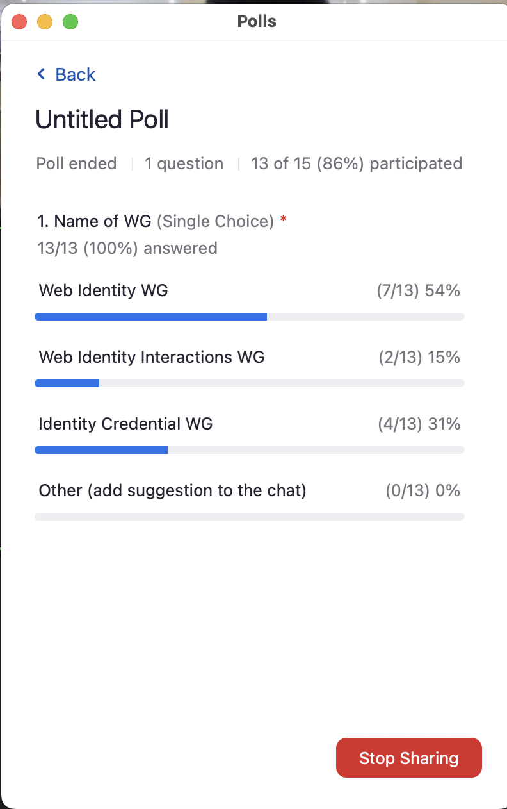

# FedID CG Notes - 12 June 2023 (Atlantic)

-   Moderator: Heather Flanagan

-   Scribe: Cameron B

Call-in details: see
[<u>https://www.w3.org/events/meetings/</u>](https://www.w3.org/events/meetings/)

Charter:
[<u>https://github.com/w3c/fedidcg</u>](https://github.com/w3c/fedidcg)

Agenda
======

-   Administrivia

    -   Scribe volunteer(s)?

    -   Reminders:

        -   [<u>Community Group
 Membership</u>](https://www.w3.org/community/fed-id/)

        -   [<u>W3C Code of Ethics and Professional
 Conduct</u>](https://www.w3.org/Consortium/cepc/)

-   [<u>FedID CG Chair
 nominations</u>](https://github.com/fedidcg/fedidcg.github.io/blob/main/charter.md#chair-selection)

    -   [<u>Achim
     Schlosser</u>](https://www.linkedin.com/in/achimschlosser/)

-   [<u>Draft Working Group
 Charter</u>](https://docs.google.com/document/d/1MCbidJTEdeoarOuqaYOA_FV0w7PxJ-BBq4pgiJLcaBY/edit)

    -   Wallets

    -   WG/CG relationship

-   FedCM

    -   Recent and upcoming launches

        -   Q1/2023 M113 - Iframes API (PR464)

        -   Q2/2023 M115 - Re-Authn API (PR458)

        -   Q2/2023 M115 - WebDriver Tests API (PR465)

        -   Q2/2023 M116 - Context API, Login Hint API and User Info API
 (PR470)

        -   ==========

        -   Q3/2023 M116 - IdP Sign-in Status API Origin Trial (PR436)

        -   Q4/2023 M119? - Auth Z API Origin Trial (PR TBD)

        -   Q4/2023 M119? - [<u>mDocs
 API</u>](https://github.com/fedidcg/FedCM/pull/464) Origin
 Trial (PR TBD)

            -   [<u>https://github.com/WICG/mobile-document-request-api</u>](https://github.com/WICG/mobile-document-request-api)

            -   [<u>https://github.com/agl/identity-credential\#mdocs</u>](https://github.com/agl/identity-credential#mdocs)

            -   <u>https://github.com/WICG/mobile-document-request-api/pull/5</u>

        -   Q1/2024 -
 [<u>1%</u>](https://privacysandbox.com/news/the-next-stages-of-privacy-sandbox-general-availability)
 of chrome user’s third party cookies blocked

        -   Q?/2024? - Multi IdP API (PR438)

        -   Q3/2024 - 1+% of chrome user’s third party cookies blocked

        -   Q4/2024 - 100% of chrome user’s third party cookies blocked

    -   

-   AOB

Notes
=====

-   Achim for Community Chair

    -   He won by a landslide

-   Draft Charter

    -   Heather: A few questions. 1) should we include wallets in the
     working group? 2) What should be the relationship between the
     Working Group and the CG. Some of this comes from discussions
     at [<u>Identiverse</u>](https://identiverse.com/). My
     understanding is that FedCMs role is to serve as the gateway
     of a user consenting to begin the login flow. The protocol
     shouldn’t matter; what matters is that there is informed
     consent. If that’s the case, why do we care what is being
     connected (SAML, Wallet Query, etc.)?

    -   Tim Cappalli: I don’t think it matters, agt least from the
     wallet side

    -   Heather: I think that matches what defines our out of scope, we
     don’t care the what, we are just facilitating the consent

    -   Vittorio: I am concerned about using FedCM as the proxy. To me
     we should look at scenarios and use cases. Ultimately this
     isn’t what I would use for leading the charter

    -   Sam Goto: We haven’t done a great job writing things down.
     Architecturally, the most appropriate layering is for Identity
     credentials
     ([<u>https://github.com/agl/identity-credential</u>](https://github.com/agl/identity-credential)),
     not FedCM. Both wallets and FedCM are built on this tech to
     facilitate identity. Wallets are in parallel with FedCM, not a
     child of it. The architecture should allow for doing either
     FedCM or verifiable credentials. There’s also the need for the
     identity selector. Users don’t care so much about where things
     are coming from. In terms of working groups it’s better to
     talk about problems than solutions. Such as for R&E we see a
     lot of SAML, but in other cases it could be tied to verifiable
     credentials that reconcile with something like SAML. So start
     from use cases. Architecturally from an API design
     perspective, some API design’s constrain what UX can be built.
     We (Google) designed FedCM to be inside the login API so we
     only need 1 system call and prompt inside the credential
     manager so we can do passkeys and passwords at the same time.
     I have an expectation that the wallet-like constructions will
     be presented to users with other versions.

    -   Tim: Never mind, that’s okay. I mean I guess if you haven’t
     commented on the doc then I assume there’s no concern with the
     charter because it’s hard to change the WG charter once we
     submit it

    -   Heather: Right now we are in a brain-storming phase. They know
     we are looking but don’t know what we are thinking. Once we
     think it’s reasonable, we put it in github, and have a list of
     orgs we want to comment on the charter in github. That’s the
     start of the W3C process. From there it goes to the various
     W3C groups to decide if this is something the W3C thinks there
     is reasonable support/logic for. We also want to reach out to
     other groups like MDOC, FIDO, and a variety of w3c groups who
     we will want comments from.

    -   Tim: FIDO and the others were represented as part of the FIDO
     work in terms of where the charter is now.

    -   Sam: I mentioned why to do this in the same place. But
     alternatively the opposite is true. If we don’t share the same
     sentiment then maybe we don’t want to do it together. One way
     to do this is to say SAML and OpenID have nothing to do with
     wallets and expect to have no impact on API design or UI/UX.
     We want autonomy to do things without addressing these other
     things. We want FedID CG to operate autonomously. This all
     comes with costs, this group now has to reconcile with other
     groups which may constrain design. So is this worth it?

    -   Tim: 1 this is a CG so we can’t make recommendations. 2) there's
     a hybrid where there are 3 specs but all are in the same WG.
     We can keep the work close without wasting people's time.

    -   Vittorio: 1) Something in the mind of an external observer is
     whether the working group substitutes and works with these
     groups. 2) We would be well served by being explicit. Imagine,
     x years from now, the WG achieves what it wants; how does the
     landscape change? As things do or don’t come to pass, it is
     more urgent to discuss how existing scenarios might change. Do
     rank parties care about the APIs? The working group didn’t
     start yet, so maybe in the scope section or in parallel, we
     need to call out what we think

    -   Brent: I like starting from a place of “what are we trying to
     solve”. One limitation for me is the charter has no listed
     deliverables. That would help a lot to have more helpful
     responses to what we are engaged in now.

    -   Heather: Would it be sufficient to say 1 or more APIs for
     credential selection, or 1 or more specifications for how to
     select an identity credential.

    -   Tim: something that mentions the API features and scope

    -   Heather: I agree with… How is this compared to SAML, openID? How
     is it now vs later?

    -   Sam: For the most part, I think Chrome agrees, but I suggest we
     call this a more general WG like WebID and not IDCredential,
     because there is a type in FedCM that is ID credential. In the
     vein of going over problems rather than solutions or payment
     on the web is the problem, then the solutions are just what’s
     in that problem. Don’t want to muddle the scope of what things
     (like MDOCs) would be executed in the WG.

    -   Tim: I don’t care what we call it so name it whatever. And there
     is precedent; the API isn’t called anything like that

    -   Vittorio: I think the roles of wallets can be defined by use
     cases. Will clarify to what extent they come into play. On the
     renaming, I think WebID is very broad and has a lot of overlap
     with other groups, so for the charter, I think we are looking
     at credentials. The name being more general could actually
     introduce new issues. I want to stay more specific. I
     recommend something more in the vein of credentials. Maybe we
     will find a name in the use cases. There are also all these
     other actors; shouldn’t the invite be extended to them?

    -   Sam: I think we should hear from the browsers, too.

    -   Tim: The next gate for voting would be when we go public under
     W3C, which is why I want the name settled, ideally today. We
     would not mention wallets directly, and we have the 3 buckets
     of ID credentials.

-   *TallTed (lurking via GoogleDoc, not on Zoom): Please register my
 vote for "Identity Credential WG". Strongly against the two "Web
 Identity" possibilities. WebID has a long, different history (see
 [<u>https://dbpedia.org/page/WebID</u>](https://dbpedia.org/page/WebID),
 among others), and will be confused and confusing with both of
 them.*

-   Heather: Does anyone have strong opinions on the relationship?

-   Vittorio: Usually, only Working Groups have a cost for
 participation, so keeping the door open between CG and WG means
 there isn’t enough differentiation from current and future working
 groups. I understand most of the discussions say go to working
 group, but many companies don’t have the resources to be part of a
 W3C

-   Heather: Yeah, this is a broader W3C issue

-   Brent: There’s a similar relationship between Credentials Community
 Group and the DID Working Group. The CCG incubates final working
 group notes and specifies terminology. We want a close
 relationship between the CG and WG as long as we have a clear
 understanding of the separation of duties.

-   Heather: the chairs will discuss and reach out to the W3C to discuss

<!-- -->

-   FedCM work planned by Google

    -   Sam: Q1 and Q2 represent things launched in Chrome such as the
     iframes API allowing FedCM to be called from iframes. Also
     added Re-Authn API which was merged thanks to feedback from
     Ben. All were reviewed by Fx for PR 458, 464, 465, 470. Up to
     this point, the spec PRs have been reviewed and implemented.
     From today on starting in Q3. Fx has been working with Mozilla
     on SSA to start doing origin trials. Aiming at Q3 for SSA
     origin trial. Waiting on PR436 from Mozilla. Login Status API
     helps unblock this discussion. AuthZ API and mDocs origin
     trial in M119. Something we want to get done in the next
     couple quarters. And then in 2024, Q1 1% of users have 3rd
     party cookies blocked without prompting. Users can unblock
     them if necessary. Continuing multi IDP API with Mozilla, some
     APIs trying to solve. And then Q3 2024 ramp up 3rd party
     depreciation, and privacy sandbox. This should give you an
     idea of the vision

    -   Vittorio: Anything describing the shape of the mDocs Api?

    -   Sam: Yes, it’s explained in this link:
     [<u>https://github.com/WICG/mobile-document-request-api</u>](https://github.com/WICG/mobile-document-request-api).
     We are working with Safari to reconcile differences here:
     [<u>https://github.com/agl/identity-credential\#mdocs</u>](https://github.com/agl/identity-credential#mdocs)

    -   Achim: On the AuthZ there’s an internal doc right? I am also a
     bit surprised by multi-idp; it could call credential API
     twice?

    -   Sam: Prototype built in Chrome, can download canaries flip
     flags, I need to add more to the docs. Extension of FedCM to
     ask for broader scope. We don’t know where things will go with
     Multi-IDp. It’s a function of how fast we can push out AuthZ
     and Sign-in status api out. Both are needed before deprecating
     3rd party cookies. Ideally it should be done before EOY, so
     these 2 APIs will help facilitate that so we can tell that to
     the ecosystem. Both of these APIs are “preservation, and
     multi-idp is an extension. If prompt is up, the 2nd call
     fails; otherwise, it succeeds. Multi-IDP allows 2 hanging
     guests.

    -   Phil Smart: If you are adding to AuthZ based on IDP, if the Auth
     party needs multi party auth, would there be a route to do
     auth?

    -   Sam: It had not occurred to us to follow those signals, but from
     what you said, it wouldn’t be an issue

    -   Heather: Where to submit that question? For the assurance bit

    -   Sam: Can submit it on github, or an auth request and scopes for
     OICD world

    -   Phil: can make it extensible to other stuff

    -   Sam: maybe in next few calls we focus on AuthZ

Attendees (sign yourself in)
============================

-   Heather Flanagan (Spherical Cow Consulting, chair)

-   Wanpeng Li (University of Aberdeen)

-   Cameron Boozarjomehri (Mozilla)

-   Matthew X. Economou (RDCT)

-   Vittorio Bertocci (Okta)

-   Phil Smart (Shibboleth Consortium)

-   Brian Daugherty (Google Identity)

-   Achim Schlosser (European netID Foundation)

-   Zachary Tan (Google Chrome)

-   Nicolas Pena Moreno (Google Chrome)

-   Christian Biesinger (Google Chrome)

-   David Huebner (DAASI International)

-   TallTed // Ted Thibodeau (he/him) (OpenLinkSw.com)

-   Sam Goto (Google Chrome)

-   Brent Zundel (DIF)

-   Gary Windham (Cirrus Identity)
