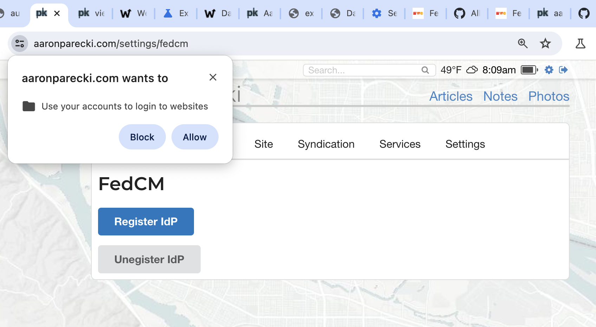
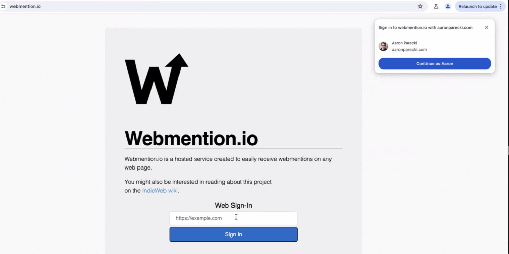

# FedID CG call (Atlantic), 21 May 2024

-   Moderator: Heather Flanagan

-   Scribe: Simone, Judith

Call-in details: see
[<u>https://www.w3.org/groups/cg/fed-id/calendar/</u>](https://www.w3.org/groups/cg/fed-id/calendar/)

Charter:
[<u>https://github.com/w3c/fedidcg</u>](https://github.com/w3c/fedidcg)

Agenda
======

-   Administrivia

    -   Scribe volunteer(s)?

    -   Reminders:

        -   [<u>Community Group
        Membership</u>](https://www.w3.org/community/fed-id/)

        -   [<u>W3C Code of
        Conduct</u>](https://www.w3.org/policies/code-of-conduct/)

    -   Reminder & [<u>Registration
    Link</u>](https://forms.gle/7vBBGVEQ52ffioWu5): Hybrid
    meetings, 20 June 2024 in Mountain View, CA

        -   WICG Digital Credentials hybrid meeting, 21 June 2024 in
        Mountain View, CA

    -   Future calls

        -   May 28 (Atlantic) and June 3 (Pacific) will be canceled

-   New implementation -
[<u>https://indieweb.org/FedCM\_for\_IndieAuth</u>](https://indieweb.org/FedCM_for_IndieAuth)

-   FedCM

    -   [<u>Allow RPs some control over the Disclosure
    Prompt</u>](https://github.com/fedidcg/FedCM/issues/559)

    -   [<u>Allow multiple IDPs to be
    used</u>](https://github.com/fedidcg/FedCM/issues/319)

    -   [<u>Allow IDP
    registration</u>](https://github.com/fedidcg/FedCM/issues/240)

-   AOB

Notes
=====

-   Administrativa, Next calls and f2f meeting:

    -   Welcome and reminder for the Hybrid meeting, use the link to
    indicate your preferences [<u>Registration
    Link</u>](https://forms.gle/7vBBGVEQ52ffioWu5).

    -   Next call canceled because of conference

<!-- -->

-   New implementation -
[<u>https://indieweb.org/FedCM\_for\_IndieAuth</u>](https://indieweb.org/FedCM_for_IndieAuth)

    -   **Aaron Parecki** has been working with FedCM and the open web
    model

    -   Register IdP in browser and bring it to websites that may not
    have a preexisting relationship with the IdP

    -   Discussion in the Repo and issues: small tweaks and a few things
    needed to be resolved

    -   Test example site for comments for blogs

    -   \[demo time from
    [<u>https://aaronparecki.com/</u>](https://aaronparecki.com/)\]

    -   Initial step was take the personal IdP (IndieAuth Provider) and
    register it.

    -   

    -   

        -   Screen grab shows the RP site and the FedCM request to authN
        via the registered Indie Auth provider.

    -   Link
    [<u>https://indieweb.org/FedCM\_for\_IndieAuth</u>](https://indieweb.org/FedCM_for_IndieAuth)
    is for those familiar with Indie Auth new to FedCM. See link
    outs to GitHub issues.

        -   Returns an OAuth authorization code and the OAuth server
        metadata endpoint. Allows RP to receive the endpoint to
        understand what is available to define capabilities, etc.

        -   Current Canary does return identityCredential.configURL
        which could also be referenced. But that may require more
        definitions (for inclusion of the OAuth server metadata
        URL in the configURL).

    -   Phil: when you register the IdP is the browser validating the
    metadata? Aaron: Yes. (Note from Aaron: I was apparently
    wrong, see \[this
    comment\](https://github.com/fedidcg/FedCM/issues/240\#issuecomment-2122944504)
    from Sam)

    -   It does use the logged-in state.

    -   This only works with user interaction. (Although the motivation
    for the interaction could be tricky)

    -   Aaron thinks there will be many IdPs and so “is logged in” IdPs
    should be filterable. Banking IdPs, Enterprise, personal, etc

    -   Sam also is on it
    [<u>https://github.com/fedidcg/FedCM/issues/593</u>](https://github.com/fedidcg/FedCM/issues/593)

    -   George Fletcher: is it feasible to layer other aspects from a
    flow perspective?

        -   Authorization code creates interesting capabilities allowing
        server side integrations, other flows. Server can generate
        the PKCE query and bind the session.

        -   Some discussion of PAR
        [<u>https://oauth.net/2/pushed-authorization-requests/</u>](https://oauth.net/2/pushed-authorization-requests/)
        Aaron asserts this would support this.

        -   Aaron notes the code implemented for assertion endpoint is
        basically FedCM check, is logged in, then does the same
        calls the authorization endpoints call.

        -   PKCE code extracted from nonce parameter, but an issue open
        –
        [<u>https://github.com/fedidcg/FedCM/issues/556</u>](https://github.com/fedidcg/FedCM/issues/556)
        – could resolve that

        -   **This is calling existing oauth endpoints - -if we get the
        issue resolved we could define my oauth authorization
        endpoint as my FedCM assertion endpoint with minimal
        changes**

    -   Ben: would it be beneficial to get access to cookies, after the
    access, sending a request to the IdP? Aaron: I would not need
    cookie access for the typical OAuth/IndieAuth use cases, only
    for silent refresh flows in OIDC that use prompt=none

    -   Ben: I have a proposal for the server end-points. The key point
    is how to make IdP registration.

        -   [<u>https://github.com/fedidcg/CrossSiteCookieAccessCredential</u>](https://github.com/fedidcg/CrossSiteCookieAccessCredential)

    -   Brian: there’s definitely layering … confusion? … about
    parameters being produced. Tim suggested OAuth and OIDC
    profiles for FedCM. This looks like a backport of OAuth things
    into open spaces. How do we anticipate progressing with this
    kind of stuff. Work in defining a profile that would be
    interoperable….

        -   Aaron disagrees – FedCM doesn’t describe the token. In order
        to be interoperable it needs to be defined. Leaving it
        open allows different protocols to define different
        profiles.

        -   Tokens - eg google – returns a JWT identity

        -   Sam Goto to Everyone (May 21, 2024, 11:38)
        [<u>https://github.com/fedidcg/FedCM/issues/585</u>](https://github.com/fedidcg/FedCM/issues/585) -
        if this goes through, it simplifies the response to a JSON
        object.

        -   Where will the interpretation get defined?

        -   Aaron: ensure FedCM steps out of the protocol layer. Leave
        it to OAuth, OIDC, IndieAuth, Open Banking….

            -   OAuth 2.0 Rich Authorization Request (*RAR*)

        -   Issues filed are so that FedCM can step out of the way of
        the other protocols, standards

        -   Sam Goto to Everyone (May 21, 2024, 11:40) Aaron goes: "I
        don't think this is a big change to FedCM". Can confirm:
        not a big deal, as far as we are concerned.
        https://github.com/fedidcg/FedCM/issues/578 We are on it,
        we can prototype some of this and report back momentarily.

            -   Brian: I (perhaps mistakenly) perceived some pushback in
            https://github.com/fedidcg/FedCM/issues/579

    -   Elf: thank you for the demo, do you have the IdP for support
    specific profiles and how do you make this explicit?

        -   Aaron: the profile does have the “type” provider, the string
        or URI could be defined by profile/community. Then the RP,
        knowing the string it filters on, would know the
        profile/standard that is intended.

        -   If the IdP supports multiple, how does the RP indicate which
        profile?

            -   Aaron thinking about it

    -   Ben this is very similar to what he is thinking about in the
    other lightweight implementation. Seconds the idea that the
    token being called token is arbitrary; changing that will
    completely make sense. Change API so the escape pattern can be
    headed off.

    -   Many thanks to Aaron!!

    -   Filter by type thread:
    [<u>https://github.com/fedidcg/FedCM/issues/585</u>](https://github.com/fedidcg/FedCM/issues/585)

Slack channel? How do we get invited/added to that?

Heather Flanagan (she/hers) to Everyone (May 21, 2024, 11:50)

https://www.w3.org/slack-w3ccommunity-invite

Simone Onofri, W3C (he/him) to Everyone (May 21, 2024, 11:51)

\#federation

Queue 
=====

-   &lt;please use Zoom hand-raise&gt;

Attendees (sign yourself in)
============================

-   Heather Flanagan (Spherical Cow Consulting, co-chair)

-   Aaron Parecki (Okta)

-   Benjamin VanderSloot (Mozilla)

-   Shannon Roddy (Self, UCBerkeley)

-   Judith Bush (REFEDS)

-   Phil Smart (Shibboleth)

-   Chris Fredrickson (Google Chrome)

-   Michael Knowles (Google Chrome)

-   Christian Biesinger (Google Chrome)

-   Simone Onofri (W3C)

-   Theo - Thhck ( liquid.surf )

-   Nicolás Peña Moreno (Google Chrome)

-   Brian Daugherty (Google Identity)

-   Sam Goto (Google Chrome)

-   [<u>Zachary Tan</u>](mailto:tanzachary@google.com)(Google Chrome)

-   Oliver Rickard (Atypon/Wiley)
