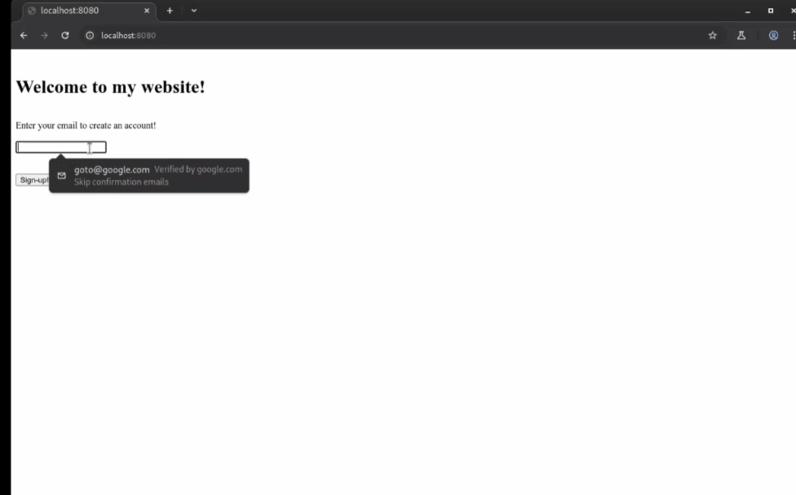
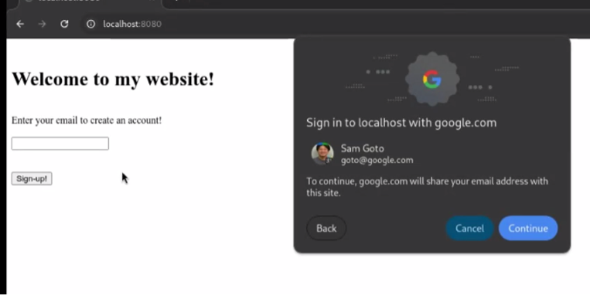

# FedID CG/WG Notes, 2025-03-18 

* Moderator: Heather Flanagan

* Scribe: Michael Knowles

Call-in details: see [https://www.w3.org/groups/cg/fed-id/calendar/](https://www.w3.org/groups/cg/fed-id/calendar/)

Charter: [https://github.com/w3c/fedidcg](https://github.com/w3c/fedidcg)

# Agenda

* Administrivia  
  * Scribe volunteer(s)?  
  * Reminders:  
    * [Community Group Membership](https://www.w3.org/community/fed-id/) or [Working Group Membership](https://www.w3.org/groups/wg/fedid/)  
    * [W3C Code of Conduct](https://www.w3.org/policies/code-of-conduct/)  
    * IIW & CG/WG meeting — 8-11 April 2025  
    * Global Digital Collaboration meeting, 1-2 July in Geneva, officially announced (see [LinkedIn post](https://www.linkedin.com/posts/goldscheider_dc4eu-globaldigitalcollaboration-activity-7307762724178919424-1Ncx?utm_source=share&utm_medium=member_desktop&rcm=ACoAAAAezwAB2XSOIfPk0uSIUxiyRZ9UraWiMrg))  
* Ecosystem Updates (5 minutes)  
  * IdP/RP implementations  
* FedCM   
  * [Horizontal Reviews Required](https://github.com/w3c-fedid/FedCM/issues/652)  
  * [Augment autofill with a conditional get \#694](https://github.com/w3c-fedid/FedCM/issues/694)  
  * [Reconsider required email field in IdentityProviderAccount \#435](https://github.com/w3c-fedid/FedCM/issues/435)  
* AOB  
  * Next call: WG call, 25 March 2025 — main topic \= discussion and kicking off the call for adoption of the DC API work item

# Notes

* Heather  
  * Will figure out how to do a F2F in Madrid in conjunction with IETF  
  * And Kobe in the Fall (November) (in conjunction with TPAC)  
* IIW & CG/WG meeting — 8–11 April 2025  
  * Heather  
    * Coming up very soon  
    * On the 11th there will be F2F meetings  
      * WebAuthn in the morning  
      * FedCM also in the morning  
      * Digital Credentials in the afternoon  
    * Looking for rooms at Google for these F2F meetings  
    * Stay tuned for actual buildings / addresses / times  
    * For any topics, let Heather know as agenda-building is happening now  
* Global Digital Collaboration meeting, 1–2 July in Geneva, officially announced (see [LinkedIn post](https://www.linkedin.com/posts/goldscheider_dc4eu-globaldigitalcollaboration-activity-7307762724178919424-1Ncx?utm_source=share&utm_medium=member_desktop&rcm=ACoAAAAezwAB2XSOIfPk0uSIUxiyRZ9UraWiMrg))  
  * Heather  
    * This has now been publicly announced (see link)  
    * No info on remote participation   
    * If you want to attend in person, let Heather know, as the organizers need to know  
    * Invitation-only event  
    * The event is free, but of course travel expenses are your responsibility.  
    * ITUT? meetings are also in Geneva the following (preceding?) week.  
* Ecosystem IdP/RP implementations  
  * Heather  
    * Anyone?  
    * If so, let Heather know for future weeks  
* FedCM — [Horizontal Reviews Required](https://github.com/w3c-fedid/FedCM/issues/652)  
  * Heather  
    * Still need Accessibility reviewers  
    * Any volunteers?  
  * Wendy  
    * Just basic reviews and work through questionnaires, build liaisons with W3C  
    * Checklists and self-reviews look at place where design intersects with user interface / user experience and does it cause any weird interactions or cause issues with accessibility software, does it cause issues with the various types of disabilities, be they physical or cognitive  
    * Getting involved is a great way to learn about all the different ways the web can be made more accessible to people with disabilities  
  * Heather  
    * Not too dissimilar to I18N review process  
    * Items include how we were talking about names, directionality, etc.  
    * Accessibility does the same kind of things  
    * Things that could trip up the screen reader?  
    * Usually “no” because implementations are left up to browsers (which tend to care about these things)  
  * Kevin Druff  
    * Any docs / questionnaires — I’ll take a look  
    * We have a team here (Capital One) who are interested in Accessibility  
    * Should be able to pull them in and get their perspective  
  * Wendy  
    * Thank you\! Will be in touch  
* [Reconsider required email field in IdentityProviderAccount \#435](https://github.com/w3c-fedid/FedCM/issues/435)  
  * Christian  
    * For a long time people were complaining about requiring email  
    * Lots of people don’t have email addresses (some only have phone numbers)  
    * Updated the UI to handle identifiers provided by name / email / phone number in that order  
    * And only one of those is required  
    * Also question about optionality — if an RP requests, in field array, that the email is required, but the accounts response does not contain email, is that allowed?  
  * Heather  
    * This had been considered to be in core, but wasn’t for now  
    * Does this change anything about that?  
  * Christian  
    * Proposal, as written, is fine for it to NOT be in core  
    * Change for Fields API would NOT be in Core  
    * Change for the Accounts endpoint WOULD be in Core  
    * But if Fields was NOT optional, then we’d have to think about how it interacted with Core  
  * Phil  
    * Is Fields API specifying what comes back from accounts endpoint and not assertion endpoint?  
  * Christian  
    * Primarily it specifies what’s in the Disclosure Text  
    * It could affect what comes back from assertion endpoint as it gets sent to IdP  
    * But is not necessarily meant as a general purpose specifier of what is returned  
  * Phil  
    * Different audiences for the two endpoints  
    * Browser is audience for Accounts endpoint  
    * RP is audience for ID Assertion endpoint  
* [Augment autofill with a conditional get \#694](https://github.com/w3c-fedid/FedCM/issues/694)  
  * Sam  
    * Have a demo to show  
    * Not necessarily a new idea — has been considered since the beginning  
    * But now in range of prototyping and considering more deeply  
    * Overall intuition that there is a massive amount of opportunity if FedCM was integrated with AutoFill  
    * AutoFill is Web Platform API to augment fields in forms  
    * Annotate different fields to provide different types of data  
    * Email addresses, credit card numbers, addresses, passwords, etc.  
    * Forms are generally unstructured, but AutoComplete allows annotations to hint / constrain fields with particular domains  
    * What if we enhanced the accounts autofill with FedCM data?  
    * Many occasions where FedCM data is constructive to AutoFill data  
    * Email addresses and phone numbers in particular  
    * Those are often part of larger Account recovery flow  
    * Entering email addresses and verifying them through verification emails / verification phone numbers (OTPs) is very cumbersome  
    * How could we augment that data with emails / phone numbers from IdPs  
    *   
    *   
    * Set membership test is involved in verifications  
    * Passkeys Conditional Get ran into ways to augment AutoFill with Passkeys  
    * Conditional UI is the answer they had  
    * From API perspective we are thinking that  
    * From user perspective, thinking that developers would gain increasing rates due to much lower friction in the sign-up flows, and users should gain  
  * Phil  
    * Info you are getting is being pulled from info from assertion endpoint  
    * In some responses that info could be encrypted and not for the browser, as the audience for that is the RP  
    * Could that be a problem?  
  * Sam  
    * Yes — definitely could see the tension between user privacy and browser needs  
    * Especially from user-expectations  
    * One answer that might have right properties in terms of user privacy is the Delegation Model of FedCM  
    * Connects only the Delegated FedCM IdP to AutoFill, but not the regular IdP to AutoFill  
    * In delegation, the browser asks the IdP to provide an SD-JWT token that is sent to the browser and intended to be opened by the browser  
    * And the browser can use that for its AutoFill entry  
    * Not sure this is the “right” way to resolve this issue  
    * We are interested in this question  
    * AutoFill is different than 2-party FedCM  
    * When users click on AutoFill users have expectations of what should happen  
    * So far, we have limited it to Delegation model  
  * Phil  
    * Delegation in the sense that the browser is the holder of your credentials as a wallet type implementation?  
  * Sam  
    * Yes, although in this case, it is more of an Ephemeral holding of credentials  
    * As opposed to wallets which are more long-term  
    * So, try not to use the term “wallet”  
    * “Holder” would be a better term here  
    * That’s another open question  
    * \<demo time\>  
    * Showing email field with a drop-down that shows  
    * Introducing a new UX surface in AutoFill specifically email address AutoFill  
    * Distinct from Self-Asserted email address  
    * Tell the user that they might want to use this one because it is verified by IdP  
    * Once the user clicks that, the hanging Promise is resolved with the verified email address  
    *  
    * Email verification is a big problem for a lot of websites  
    * Might help with the Seamless Access problem?  
    * Maybe we can augment AutoFill with, e.g., Stanford email address?  
  * Phil  
    * At what point did the user consent to using Google to deliver their verified email address?  
  * Sam  
    * Still working through the proper consent model  
    *  
    * Because this is doing the SD-JWT dance, we might be able to waive the second permission prompt  
    * The question we are asking the user, because it is privacy-preserving, there is no further need to ask the user  
  * Phil  
    * Could that fit the Registration API?  
    * In OpenID Federation, discovery doesn’t have a great story so maybe these types of things could help there.  
  * Sam  
    * If we want to call email verification for these purposes maybe we could waive the permission prompt  
    * Also if you have the Federation Operator we could maybe waive the permission prompt too  
  * Brian Daugherty  
    * Mental mode: In today’s world AutoFill will cache stored data with any website  
    * When we talk about protocol level info they are bound to domains  
    * How would that be changed / augmented in this proposal  
    * Would be great if browser could verify and decode the JWTs that are issued  
    * And cache them and say they will be universally shared  
    * Or we’ll have to answer why is federated not cached but password is cached?  
  * Sam  
    * Interested question  
    * When bound to an origin do you mean the audience field?  
  * Brian  
    * Yes  
  * Sam  
    * Look at SD-JWTs or mDocs — they are equivalent  
    * The way they work — the IdP gives the browser a JWT without an Audience field  
    * Then binds the key that is generated ephemerally to the JWT  
    * Explicitly not adding Audience  
    * But then the signature allows the browser to make audience presentations on behalf of the IdP  
    * Then the browser signs specific JWTs to specific audiences with a specific “audience” field for given audiences  
  * Brian  
    * Sounds like normal PKI  
  * Sam  
    * Link to longer description of how that works — [https://github.com/w3c-fedid/delegation](https://github.com/w3c-fedid/delegation)  
    *   
    * Also — we’re still experimenting with all of this  
    * I think if we ask if people have email verification problems, I think most people would agree / say yes  
    * If we can provide emails without forcing the user to jump back to the inbox  
  * “1020” Zacharias  
    * Isn’t this the main holder handing over control of their domain to the browser?  
    * If i verify my email that i have control over email address at a particular domain  
    * The “right now” part disappears if you hand it over  
  * Sam  
    * Good question  
    * So far the issuer gets to choose the expiration date of the SD-JWT  
    * If they want to make entirely ephemeral they can  
    * So if they want to limit it to a very short time (seconds) that is fine  
  * Phil  
    * In this case, with this delegation model, would the user have to consent to a presentation to use it in AutoFill?  
  * Sam  
    * The UI we showed is what we are hoping to accomplish  
    * Because the issuer trusts the browser  
  * Phil  
    * Normally assume when holder makes a presentation it is because the user has made consent to the verifier  
  * Sam  
    * This is the UI where a user is agreeing to this  
    * This particular moment is where the user is agreeing to present a verified email address to the RP / website  
    * So the answer is “yes” but it is in the user clicking on the FedCM AutoFill item  
    * Probably will change in the future  
  * Wendy  
    * How will this work for unique email addresses for each website  
  * Sam  
    * Zero Knowledge Proofs (ZKP) is the answer  
    * There’s an issue in the Delegation Issue (FedCM Delegated Model)  
    * Intuition is that ZKP can support *Verified* and *Directed (Unique)* and *Held*  
    * We can solve 2 of those 3 without ZKP but ZKP should be able to solve all 3  
    * Directed and Verified can be solved by regular OIDC but IdP can learn  
    * Directed and Issued can be solved by browser issuing but relies on out-of-band verification.  
    * But ZKP can produce a derived email address that is a hash of the user's main email address and the RP origin and will still go to the user’s email.  
    * [https://github.com/w3c-fedid/delegation/issues/3](https://github.com/w3c-fedid/delegation/issues/3)  
  * Heather  
    * Alan’s asking about iCloud+  
  * Alan Buxey  
    * Doesn’t change the domain but makes the address unique  
    * Apple offers iCloud+ that offers unique-per-RP email addresses  
  * Sam  
    * Yes that was what I was referring to  
    * iCloud has made it Directed but not Verified  
  * Alan  
    * (prefix)  
  * Sam  
    * Yes, but in the iCloud+ your global email is still transparent  
    * So you still need ZKPs to ensure the email will go to the right person but not reveal what the global ID is  
    * ZKPs are hard to understand but seem to have all the right properties  
  * Brian  
    * Have you thought about verified Phone Numbers and SMS verification?  
  * Sam  
    * Yes \- works somewhat differently than verified emails  
    * Authority of verified phone number is different than verified emails  
    * Have thought about it  
    * Closest we have is WebOTP that provides automatic access to SMS OTP codes  
    * But it’s not the same crypto verification that we have for verified emails  
    * So, phone numbers will probably take more as the authority for phone numbers is not as well-defined as with emails  
    * But for phone numbers, you don’t know who to ask — who is the telecom provider who actually owns this?  
    * For low-assurance cases plenty of websites would take derivations  
    * For example would take Google’s phone number verification as a trustworthy verification  
    * That would give a lot of authoritative information  
  * Brian  
    * Optional Email is now being discussed and possibly using Phone Njumbers instead of email addresses identifies  
  * Sam  
    * Emerging Markets and newer generations only use phone numbers  
    * So, increasing support for that is becoming very important.  
* AOB: Next call: WG call, 25 March 2025 — main topic \= discussion and kicking off the call for adoption of the DC API work item  
  * Heather  
    * Next call is WG  
    * Adoption of DC API work item  
    * If not an area people are concerned about  
    * How are we looking at how Federation is different from DC work  
    * Just published a blog post on how these two topics relate and how they are different  
    * [https://sphericalcowconsulting.com/2025/03/18/dc-vs-federation/](https://sphericalcowconsulting.com/2025/03/18/dc-vs-federation/)

# Attendees (sign yourself in)

* Heather Flanagan (co-chair, Spherical Cow Consulting)  
* Michael Knowles (Google Chrome)  
* Yi Gu (Google Chrome)  
* Christian Biesinger (Google Chrome)  
* Zachary Tan (Google Chrome)  
* Nicolas Pena Moreno (Google Chrome)  
* [Ted Thibodeau](https://github.com/TallTed/) (he/him) ([OpenLink Software](https://openlinksw.com/))  
* Andrew Regenscheid (NIST)  
* Alan Buxey (MyUNiDAYS Ltd.)  
* Brian Daugherty (Google Identity)  
* Erica Kovac (Google Chrome)  
* Phil Smart (Shibboleth/Jisc)  
* Steffi Dobretzberger (DAASI International)  
* Wendy Seltzer (WG co-chair)  
* Chris Fredrickson (Google Chrome)  
* Ryan Galluzzo (NIST)  
* Kevin Druff (Capital One)  
* Björn Hjelm (Yubico)

